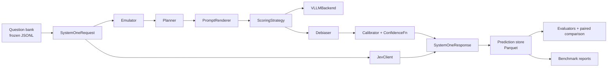

# jevemu: design (Jev emulator on open models)

## Overview

jevemu is a Python SDK that reproduces TypeSafe's Jev API (`POST /v1/systemone`) on an open model served by vLLM. To get each answer's probabilities, it makes the model's next token an answer label, then renormalizes the logprobs over the valid labels.

- **What it emulates:** Jev's three question types, with the same request and response schema:
  - Noul (yes/no) returns P(yes).
  - Choice takes 2–255 options and returns the chosen option, probabilities and a confidence.
  - Score takes 2–10 ordered levels and returns an expected score, probabilities and a confidence.
- **Core technique:** letter labels; an `Answer:` prefill, so the next token is a label; constrained decoding to the label set; merging surface variants (`"A"`, `" A"`); and renormalization over valid labels. The recommended strategy (`auto_single`) answers every question in one model call with one-token labels: letters up to 32 options, two-capital codes (`AA`, `AB`, ...) above that. Older fallbacks, a token prefix tree ("trie") and echo (which scores each answer's full text with vLLM's prompt logprobs), take several calls per question and remain available.
- **Calibration:** optional debiasing (PriDe, permutation, contextual calibration) and post-hoc calibrators (temperature, Platt, isotonic), fitted only on held-out data. PriDe estimates the model's preference for each answer label and divides it out.
- **Evaluation:** the emulator and the real Jev API answer the same frozen question bank, scored by the same code with the same metrics. Neither system uses chain-of-thought. Jev's published calibration claims are not used.
- **Benchmarks:** config-driven suites measure quality (accuracy and calibration across datasets) and performance (latency, throughput, cost) for any mix of systems.

Two studies came first, and they settle details the code depends on: an audit of the evaluate-idk code, and probes of vLLM's logprob behavior.

## Scope and key decisions

| Decision | Choice | Reason |
| --- | --- | --- |
| Backend | vLLM (HTTP server + offline engine); hosted chat APIs added later | Constrained choice, configurable logprob mode, prompt logprobs/echo, tokenizer endpoint, prefix caching |
| Other backends | Ollama dropped; OpenAI and OpenRouter implemented (`jevemu.backends.chat_api`); llama.cpp not started ([TODO.md](../TODO.md)) | Same `Backend` protocol; see Appendix |
| Wire format | Mirror Jev field-for-field; emulator extras under `x_jevemu` | Same payload runs against Jev or jevemu |
| Evaluation | Paired, same data, same metrics, same code path for both systems | No reliance on vendor claims |
| Chain-of-thought | None for either system | Jev cannot reason in text |
| evaluate-idk | Reference only (no vendoring); conformance-tested | Repo has no LICENSE file |
| Primary calibration metrics | Brier and NLL; ECE secondary | ECE is noisy at GPQA-scale n |
| Benchmarks | Config-driven quality and performance suites | Needed for regressions, ablations and model choice |
| vLLM runtime | Official `vllm/vllm-openai` Docker image pinned by digest (`docker/vllm/compose.yaml`) | Reproducible CUDA/torch/vLLM stack; the client is pure HTTP and never imports vLLM |
| CI | No hosted CI; `scripts/check.sh` gate via pre-commit/pre-push hooks; live tiers run locally | Live tests need a GPU and API keys; hosted runners have neither |

Metric names used throughout: NLL is the negative log-likelihood of the correct answer; Brier is the mean squared error of the probability vector; ECE is the expected calibration error, the gap between confidence and accuracy averaged over bins. Lower is better for all three.

**Out of scope:** fine-tuning a model, a hosted service, multi-question joint generation (it would break Jev's per-question independence), and non-English data.

## Findings: the Jev contract

Jev launched on September 15, 2026 as TypeSafe AI's first "System One" model: it returns typed decisions with probabilities, not text. Its API is small, public and easy to mirror. Its confidence formula and calibration are not specified, so both must be measured.

| Element | Specification |
| --- | --- |
| Endpoint | `POST https://api.typesafe.ai/v1/systemone`, Bearer auth; `GET /v1/models` |
| Request | `state` (string, object or array), `model`, `questions` (map of your IDs to questions; the IDs are not sent to the model) |
| `noul` | `instructions`, optional `criteria {true, false}` → `{type, noul}` = P(yes); no confidence |
| `choice` | `instructions`, `criteria: map<option, description or null>`, up to 255 options → `{type, choice, probabilities, confidence}` |
| `score` | `instructions`, `criteria: array` of 2–10 ordered levels → `{type, score = Σ i·pᵢ, legend, probabilities, confidence}` |
| Response | `{model: "jev-1.13.0", answers, usage: {input_tokens, output_tokens}}` |
| Models | `jev-1.13.0`; aliases `jev-latest` and `jev-preview` both resolved to 1.13.0 in September 2026 |
| Limits | \~64k tokens per request, \~32k for state plus the longest question; 250,000 tokens/s and 1,200 requests/min (stated as dynamic) |
| Errors | 401, 422, 429, 529; retry on 429/529 honoring `retry-after` |
| Price | $0.042 per 1M input tokens; output free |
| Precision | Probabilities reported to 0.01; exact zeros occur |

**Semantics to copy:** every question sees the same state and is evaluated on its own; one answer never becomes context for another. `choice` is the argmax, and probabilities sum to 1.

**Confidence formula.** The docs call confidence a statistic of the distribution and give the approximation (K·p\_max − 1)/(K − 1), where K is the number of options and p\_max the largest probability. It matches TypeSafe's three-option examples but not several four- and five-option ones:

| Example | K | p\_max | Reported | Formula | Match |
| --- | --- | --- | --- | --- | --- |
| Score bug\_severity (docs) | 3 | 0.57 | 0.35 | 0.355 | Yes |
| Score frustration (docs) | 3 | 0.74 | 0.61 | 0.61 | Yes |
| Choice department (API ref) | 3 | 0.88 | 0.81 | 0.82 | ≈ rounding |
| Score outfit formality (docs) | 5 | 0.86 | 0.89 | 0.825 | No |
| Score candidate fit (docs) | 4 | 0.52 | 0.52 | 0.36 | No |

Decision: confidence is a pluggable function. The default is `mode_distance`, fitted from real Jev responses (`docs/research/calibration.md`); for Choice questions it equals the formula above.

**Calibration is claimed, not quantified.** TypeSafe publishes no ECE or Brier numbers. Small independent tests report ECE from about 0.02 to 0.16, depending on the task. One reviewer found that fitting a single temperature on 50–300 labels removed most of the error. TypeSafe's latency figures (70–500 ms) and its headline "193.6x faster, 444.6x cheaper" come from its own evaluations, so this design does not rely on them.

## Findings: vLLM capabilities

vLLM supports everything the emulator needs. A capability probe checked the three behaviors that could invalidate scoring on the pinned version (vLLM 0.30.0 with Qwen3-0.6B; `docs/research/vllm_probe_report.md`):

- the constraint is enforced;
- reported logprobs are taken after the constraint mask;
- a `top_logprobs` request above the cap fails with HTTP 400 instead of being truncated.

| Capability | What vLLM does | Design consequence |
| --- | --- | --- |
| Constrained choice | Top-level `structured_outputs={"choice": [...]}` (what `extra_body` produces); also `json`, `regex`, `grammar`; backends xgrammar / guidance. On 0.30.0 the constraint is enforced and masked tokens still fill the top-k list at −9999 | Constrain to label strings; treat ≤ −9999 as −∞ |
| `guided_*` fields | Removed in v0.12.0. 0.30.0 ignores them with a server-side warning and returns HTTP 200 with unconstrained text (verified; see also issue #53975) | Never emit `guided_*`; startup probe asserts the constraint is enforced |
| `--logprobs-mode` | `raw_logprobs` (default, before processors) or `processed_logprobs` (after temperature, top-k/top-p). On 0.30.0 the grammar mask is applied before both: the allowed tokens' logprobs sum to 1 in either mode, and the modes agree under greedy decoding | Default to raw; client-side renormalization still runs (a no-op under S2) |
| `--max-logprobs` | Default 20; `-1` means no cap (risk of running out of GPU memory). A request above the cap fails with HTTP 400 (`Requested sample logprobs of 65, which is greater than max allowed: 64`); there is no silent truncation. The cap only validates requests: the sampler's top-k is sized per batch, so a high cap costs nothing for small requests | Launch with 576: 64 covers letter schemes, 576 every code label of a 255-option question (`auto_single`); clamp `top_logprobs` to the probed cap; fall back to echo or explicit-token scoring otherwise |
| Explicit-token logprobs | 0.30.0 accepts `logprob_token_ids` on `/v1/chat/completions` and `/v1/completions` and returns the sampled token plus the requested ids; issue #29280. At most 128 ids per request (`MAX_LOGPROB_TOKEN_IDS`, HTTP 400 above), fewer than banking77's 154 code surfaces | S5 is viable over HTTP for up to 128 surfaces; the adapter does not use it (`explicit_token_logprobs` stays False); `auto_single` reads codes from a constrained top-k instead |
| Echo scoring | `/v1/completions` with `echo: true, logprobs: 1, max_tokens: 0` works on 0.30.0 and returns exactly the prompt tokens; first token is `null`; values floored at −9999. Requests with prompt logprobs never read the prefix cache | Score whole option texts; treat ≤ −9999 as −∞; each option pays a full prefill |
| Assistant prefill | The chat endpoint can only render the prefill as a continued final assistant message (`continue_final_message=true, add_generation_prompt=false`). That is not always the prompt the model answers from: some templates add tokens only on the generation prompt, and some trim the final assistant message. Gemma 4 12B and 26B-A4B with thinking off open their turn with an empty thought channel, but only on the generation prompt. So the continued render ended `<\|turn>model\nAnswer:`, while the model's own reply starts `<\|turn>model\n<\|channel>thought\n<channel\|>`. Qwen3.5/3.8 trim `Answer: ` to `Answer:`. Every other preset (Qwen2.5/3/3.5/3.6/3.8, Gemma 4 E4B, whose pinned template has no such channel, Llama 3.2, Phi-4-mini, SmolLM3, Ministral 3) gives identical token ids both ways (HF templates at the pinned revisions) | Render the messages with the generation prompt through `/tokenize`, append the prefill's own tokens (trailing whitespace as separate tokens), and score the ids on `/v1/completions`, which enforces `structured_outputs` like the chat endpoint. The probe records whether the two renders differ (check f). Gemma 4 12B and 26B-A4B runs made before this fix were redone |
| Chat-template defaults | `--default-chat-template-kwargs '{"enable_thinking":false}'` is merged into every chat and `/tokenize` render (request kwargs win per key); not visible over HTTP | Thinking off is a server launch flag per preset; clients declare it via `JEVEMU_VLLM_DEFAULT_CHAT_TEMPLATE_KWARGS` for `BackendInfo` and the probe cache key |
| Prefix caching | `--enable-prefix-caching`; `usage.prompt_tokens_details.cached_tokens` is reported only with `--enable-prompt-tokens-details`. In bf16, cache hits shift logprobs (see Risks). Hybrid Gated-DeltaNet models (Qwen3.8) cache in 784-token blocks (`mamba_cache_mode=align`) and hits do not shift logprobs | Shared prompt prefix is cheap across states or questions (first-token calls only; on Qwen3.8 only prompts ≥ 784 tokens) |
| CPU | Pre-built `+cpu` wheels; `Qwen/Qwen3-0.6B` works | Optional local CPU smoke tests, not part of the default gate |

Pin one vLLM version per report and record it in every artifact: echo and prompt-logprob behavior has changed across releases (for example issue #27477).

## Findings: evaluate-idk

evaluate-idk tests whether LLMs choose "I don't know" (IDK) when they should. We audited its code at SHA `e5cb812`; the evidence, with file:line references, is in `docs/research/evaluate_idk_audit.md`.

| Item | Status | Finding |
| --- | --- | --- |
| Files | Verified | `custom_tasks.py`, `run_eval.py`, `evaluate.py`, `summarize_results.py`, `analyze_answers.py`, `analyze_questions.py`, `pyproject.toml`, `tasks.txt`, `uv.lock`, `results/` |
| License | Verified absent | No LICENSE file, so no copying or vendoring |
| Framework | Verified | Hugging Face lighteval 0.11.0 (custom tasks, `litellm` backend), pinned in `uv.lock`; Python ≥ 3.10 |
| Model access | Verified | OpenRouter via `OPENROUTER_API_KEY`; `HF_TOKEN` for datasets |
| Entry point | Verified | `python evaluate.py` runs `run_eval.py endpoint litellm …` once per model. `run_eval.py` is the lighteval CLI plus a reasoning-effort patch. `evaluate.sh` was deleted in October 2025, so the README is stale. Every model is commented out at the pinned SHA |
| Prompt | Corrected | Asks for step-by-step thinking, states +1 / −1 / 0 scoring, and asks for "Final Answer: ###X###". The task instruction and query form one user message; there is no system prompt. LEXam adds a long legal chain-of-thought instruction |
| IDK option | Verified | Adds E) "I don't know" with an ASCII apostrophe; E always last, gold always in A–D. A–D are shuffled with the global `random`, seeded once to 42 at import: one sequential stream over rows in dataset order, not a per-question RNG |
| Metrics | Corrected | Per item (`trad_score`, `idk_score`, `idk_freq`, `extract_fail`): correct = (1, +1, 0, 0), E = (0, 0, 1, 0), wrong letter = (0, −1, 0, 0), no letter = (0, −1, 0, 1). Corpus means. At most one letter is ever extracted, so the "best outcome" rule never applies |
| Extraction | Verified | lighteval's letter regexes (six priority groups; the rightmost match wins), then an evaluate-idk fallback: `###X###`, boxed forms, "answer: X", "option/choice X". Exact patterns are in the audit |
| Datasets | Corrected | GPQA-Diamond (`train`, 198) and LEXam `mcq_4_choices` `test` filtered to `language == "en"` (619, not \~1,650). Neither revision is pinned; LEXam's test file changed in December 2025. lighteval's upstream GPQA shuffle is not used |
| Standard errors | Verified | lighteval `mean_stderr`: sample SD with ddof = 1, divided by √n. For 0/1 metrics this is √(p(1−p)/(n−1)). The README's ensemble rows use ddof = 0 |
| README numbers | Verified | The GPQA table came from an older task file with a different prompt and seed. The LEXam table used the pinned prompt, but its ensemble row is stale |

**Two implications for jevemu:**

- The evaluate-idk prompt asks for chain-of-thought, which Jev cannot do. Both systems therefore run a pre-registered variant of the protocol without chain-of-thought. Its numbers are not comparable to the tables in evaluate-idk's README.
- Under +1 / 0 / −1 scoring, answering has expected value 2p − 1. A calibrated system should answer only when p\_max > 0.5, so this benchmark directly tests calibration.

## Architecture

A request passes through five components. The emulator and Jev return the same response type, so one metrics path serves both.



Along the emulator's path, the Planner picks a strategy, the backend returns token logprobs, and debiasing and calibration run on the client.

**Design principles:**

1. **One schema.** Jev and the emulator both return `SystemOneResponse`. Emulator-only diagnostics sit under `x_jevemu`, which Jev clients ignore.
2. **One metrics path.** Metrics never branch on which system produced a record, except to group results.
3. **Capabilities, not type checks.** Strategies read `Backend.capabilities` and fail fast. This is what lets other backends, such as OpenAI or llama.cpp, slot in.
4. **All probability maths on the client, in log space.** Backends return raw token logprobs. Renormalization, variant merging, debiasing and calibration are pure, deterministic and unit-tested.
5. **One question per scoring call (per permutation).** This keeps Jev's independence semantics, and prefix caching keeps it cheap.

## Core types and public API

The public surface is the Jev-mirroring pydantic types, the `Emulator`, the `JevClient` and the evaluation entry points. Anything with an async `system_one(request)` method (the `SystemOneClient` protocol) plugs into the harness and benchmarks.

```python
# jevemu/types.py (pydantic v2, mirrors the Jev wire format)
JSONish = str | dict | list

class NoulQuestion(BaseModel):
    type: Literal["noul"] = "noul"
    instructions: JSONish
    criteria: dict[Literal["true", "false"], JSONish] | None = None

class ChoiceQuestion(BaseModel):
    type: Literal["choice"] = "choice"
    instructions: JSONish
    criteria: dict[str, JSONish | None]      # 2..255 keys, order preserved

class ScoreQuestion(BaseModel):
    type: Literal["score"] = "score"
    instructions: JSONish
    criteria: list[JSONish]                  # 2..10 levels

Question = Annotated[ChoiceQuestion | ScoreQuestion | NoulQuestion, Field(discriminator="type")]

class SystemOneRequest(BaseModel):
    state: JSONish
    model: str = "jev-1.13.0"
    questions: dict[str, Question]

class NoulAnswer(BaseModel):   type: Literal["noul"]; noul: float
class ChoiceAnswer(BaseModel): type: Literal["choice"]; choice: str; probabilities: dict[str, float]; confidence: float
class ScoreAnswer(BaseModel):  type: Literal["score"]; score: float; legend: dict[str, Any]; probabilities: dict[str, float]; confidence: float

class EmulatorDiagnostics(BaseModel):
    backend: str; backend_model: str; vllm_version: str
    strategy: str; label_scheme: str; permutations: int = 1
    observed_mass: float                     # sum of valid-label probability before renormalization
    missing_labels: list[str] = []
    raw_probabilities: dict[str, float]      # before debiasing and calibration
    calibrator: str | None = None
    n_backend_calls: int; latency_ms: float; cached_tokens: int | None = None
    warnings: list[str] = []

class SystemOneResponse(BaseModel):
    model: str
    answers: dict[str, ChoiceAnswer | ScoreAnswer | NoulAnswer]
    usage: Usage                             # input_tokens, output_tokens
    x_jevemu: dict[str, EmulatorDiagnostics] | None = None
```

```python
# jevemu/emulator.py
class Emulator:
    def __init__(self, backend: Backend, *, renderer: PromptRenderer | str = "default",  # state_first
                 strategy: ScoringStrategy | Literal["auto"] = "auto",  # SingleCallStrategy() for large models
                 debiaser: Debiaser | None = None, calibrators: CalibratorRegistry | None = None,
                 confidence_fn: ConfidenceFn = DEFAULT_CONFIDENCE,  # mode_distance, fitted to Jev
                 max_concurrency: int = 32,
                 include_diagnostics: bool = False, round_to: float | None = None): ...
    async def system_one(self, request: SystemOneRequest) -> SystemOneResponse: ...
    def system_one_sync(self, request: SystemOneRequest) -> SystemOneResponse: ...

# jevemu/jev_client.py
class JevClient:
    def __init__(self, api_key: str | None = None, *, model: str = "jev-1.13.0",
                 base_url: str = "https://api.typesafe.ai", cache: ResponseCache | None = None,
                 max_rpm: int = 1200, strict_version: bool = True): ...
    async def system_one(self, request: SystemOneRequest) -> SystemOneResponse: ...

# jevemu/eval/harness.py
def build_question_bank(dataset: str, *, seed: int, idk: bool, n_permutations: int = 1) -> QuestionBank: ...
async def run_system(system: SystemOneClient, bank: QuestionBank, *, protocol: Protocol) -> PredictionSet: ...
def compare(a: PredictionSet, b: PredictionSet, *, folds: int = 5,
            calibrators: Sequence[str] = ("identity", "temperature"),
            n_boot: int = 10_000, seed: int = 0) -> PairedReport: ...
```

`jevemu.compat.typesafe` exposes `Choice`, `Score`, `Noul` and a `TypeSafeClient`-shaped facade, so code written for `typesafe-sdk` can switch to the emulator by changing one import.

## Backend protocol and vLLM adapter

The backend returns raw token logprobs and declares its capabilities. The capability probe measures behavior at startup rather than trusting the docs.

```python
# jevemu/backends/base.py
@dataclass(frozen=True)
class Capabilities:
    top_logprobs_max: int                 # from --max-logprobs
    structured_choice: bool
    logprobs_mode: Literal["raw_logprobs", "processed_logprobs"]
    mask_reflected_in_logprobs: bool      # measured by the capability probe, never assumed
    echo_prompt_logprobs: bool
    explicit_token_logprobs: bool
    assistant_prefill: bool
    prefix_caching: bool

class Backend(Protocol):
    capabilities: Capabilities
    async def next_token_logprobs(self, prompt: RenderedPrompt, *, allowed: Sequence[str] | None,
                                  top_k: int) -> NextTokenDist: ...
    async def sequence_logprobs(self, prefix: RenderedPrompt,
                                continuations: Sequence[str]) -> list[SeqScore]: ...
    async def tokenize(self, text: str) -> list[int]: ...
    async def detokenize(self, ids: Sequence[int]) -> str: ...
    async def health(self) -> BackendInfo: ...   # model id, HF revision, vLLM version, flags
```

**Server launch** (pinned image via `docker/vllm/compose.yaml`; flags checked by `health()`):

```bash
vllm serve <model> --max-logprobs 576 --logprobs-mode raw_logprobs \
  --enable-prefix-caching --enable-prompt-tokens-details --max-model-len 8192 --seed 0
```

Per-model settings live in presets, `docker/vllm/presets/<name>.env` (model, pinned revision, `--max-model-len`, `--gpu-memory-utilization`, `--default-chat-template-kwargs`, extra flags). Start one with `scripts/serve_vllm.sh --preset <name>`. Examples: `qwen3-0.6b` (default) and `qwen3.8-27b-awq` (thinking off, `--language-model-only`, 0.95 of the GPU, `--max-num-batched-tokens 1024` to bound echo's full-vocabulary prompt-logprob spike).

Record the image digest with the vLLM version in every artifact.

**Adapter behavior (`backends/vllm_http.py`):**

- **Prompt tokens.** `/tokenize` renders the messages before the `Answer:` prefill with `add_generation_prompt=true` and the chat-template kwargs (for thinking models the server's `--default-chat-template-kwargs`, set by the preset, turns thinking off). The prefill is tokenized as plain text and appended, trailing whitespace (`Answer: `) as its own tokens, so the model reads the prefill exactly where its own reply would start; the template never sees it (see "Assistant prefill" above).
- **First-token request.** `/v1/completions` on those ids with `max_tokens=1, temperature=0`, `logprobs` up to the cap, `return_tokens_as_token_ids=true` and `structured_outputs={"choice": labels}`. The completions top-k is a map; keyed by text it keeps only one of several tokens that decode alike (Gemma 4 has byte tokens `<0x41>`, `<0x31>` beside `A`, `1`, and a choice constraint allows both), so it is keyed by id and each id's text comes from `/detokenize`, cached per backend. Same-text tokens add.
- **Echo path.** `/v1/completions` with `echo=true, logprobs=1, max_tokens=0`, one request per option. vLLM 0.30.0 does not read the prefix cache for prompt-logprob requests, so each request recomputes the prefix. Drop the null first token and treat ≤ −9999 as −∞.
- **Guardrails.** A unit test ensures the request builder never emits `guided_*`. At startup, a probe with `choice=["Q","Z"]` asserts the output stays in that set.
- **Capability probe.** Sends a fixed two-option prompt with and without the constraint. If the top-k list holds only valid tokens, the logprobs reflect the constraint mask; if it also holds invalid tokens, they do not. Results are cached per (vLLM version, model, revision, image, flags). On 0.30.0 the mask is reflected (`docs/research/vllm_probe_report.md`).
- **Concurrency.** A per-backend semaphore (default 32); vLLM batches concurrent requests.
- **Metadata.** Record the vLLM version, model HF revision, dtype and flags in every prediction set.

**Offline engine (`backends/vllm_offline.py`).** The same protocol over `LLM.generate`, using `SamplingParams` for logprobs, prompt logprobs and structured outputs. It serves batch evaluation and local CPU smoke runs. Latency comparisons against Jev must use the HTTP path.

## Prompting and scoring strategies

The default strategy reads one token's logprobs over letter labels. The other strategies cover cases where that is not exact.

**Prompt layouts** (Jinja2 templates, byte-stable for caching):

- `question_first` (one question over many states): system = instructions and labelled criteria; user = state; assistant prefill `Answer:`. The shared prefix is the question.
- `state_first` (many questions over one state; the default): user = state, then question and criteria; prefill `Answer:`. The shared prefix is the state. In selection it scored 0.05–0.06 higher macro accuracy than `question_first` on every preset tested (`docs/research/selection.md`).
- Strings render verbatim. Objects and arrays render as pretty JSON with stable key order.
- End with `Answer:` and no trailing space: tokenizing the space together with the letter matters for both accuracy and calibration ("Mind the Gap", EMNLP 2025).

**Label schemes:** Choice uses `A…Z`, then `a…z` (52 labels). Score uses digits `0…9`. Noul uses `Yes`/`No`. Warm-up checks, per tokenizer, that each label is a single token.

On Qwen3 (and, measured, on Qwen3.8's 248k-token vocabulary), letters, `Yes` and `No` are single tokens with or without a leading space. A digit with a leading space is two tokens (`" 7"` = `" "` + `"7"`). Forcing the bare digit right after `Answer:` distorts the distribution: the model puts ~0.9998 on the space, and we measured 0.976/0.023 forced vs ~0.80/0.20 by echo.

So when every label's spaced form is a space token plus a one-token bare label, S1/S2/S3 extend the prefill to `Answer: ` and read the bare digit there. Across 10 live Score prompts this matched echo within 0.06 (Qwen3-0.6B) and 0.016 (Qwen3.8-27B). The space must reach the model: Qwen3.8's template trims it, which silently moved Score probabilities by up to 0.175 until the adapter appended the space token itself. Letters and Yes/No allow both surfaces right after `Answer:`. Evidence: `scoring/constrained.py` docstring and `docs/research/vllm_probe_report.md`.

**Option-key scheme (`keys`):** echo and trie score the option keys themselves (a `- key: description` listing and "Respond with the option name only."). This lifts the 52-label limit to Jev's 255 options. Known echo limitation: under `sum`, an option that is a prefix of another absorbs its mass. The trie handles this correctly.

**Code scheme (`codes`, `auto_single` only):** Choice questions above 32 options are labelled `AA`, `AB`, ... (lexicographic), keeping only the codes whose bare and space-prefixed surfaces are each one token for the served model (checked through `/tokenize`, cached per backend: 522 of 676 on Qwen3.6, 588 on Gemma 4). They are listed and asked for like letters (`AB) name`, "Respond with the letter only."), so the templates and every `template_id` are unchanged; on 300 banking77 and 300 CLINC150 screen items (Qwen3.6-35B-A3B GPTQ) "Respond with the code only." moved accuracy by -1 and +4 items, within noise. S2 allows both surfaces of every code; with the mask reflected every allowed first token (codes, the space, each first letter bare and spaced) ranks above the masked ones, so a top-k of that many entries (163 for 77 options, 315 for 150, at most 563 for 255) holds every code's exact logprob in one call.

**Strategies:**

| ID | Strategy | When | Cost |
| --- | --- | --- | --- |
| S1 | First-token letter: renormalize top-k logprobs over labels, merging surface variants | Default, K ≤ 52 | 1 call |
| S2 | Constrained first-token: same, with `structured_outputs.choice` | Default when the constraint works; exact when the mask is reflected (it is on 0.30.0) | 1 call |
| S3 | Token trie: chain-rule product along each label's token path; query only branching nodes; prune paths below τ = 1e-4 and report pruned mass | Multi-token labels, K > 52 without echo | Branching nodes (\~1–3) |
| S4 | Echo sequence scoring: sum logprobs of each option text; modes `sum` (default), `mean`, `pmi` | Semantic option keys, K up to 255 | K calls, each a full prefill (no prefix cache for prompt logprobs on 0.30.0) |
| S5 | Explicit-token logprobs | Token ids accepted over HTTP on 0.30.0 (at most 128 per request); adapter path not implemented | 1 call |
| S6 | Verbalized probabilities (JSON) | Benchmark baseline only; never chosen by `auto` | 1 call |

**Renormalization.** p(label) = exp(ℓ − logsumexp(ℓ over valid labels)), where ℓ is a label's logprob. `observed_mass` is the total valid-label probability before renormalization. If it falls below 0.5 under raw logprobs, emit a warning: the model wanted to write something else.

**Missing labels** (a valid label absent from the top-k list), in order of preference:

1. Re-score via explicit-token logprobs if available.
2. Otherwise echo-score only the missing labels.
3. Otherwise assign an upper bound, the smallest returned logprob, and set `truncated=True`.

Never fill in a silent zero.

**Strategy selection (`auto`):**

| Condition | Strategy |
| --- | --- |
| K × variants ≤ `top_logprobs_max` | S2 if the constraint works, else S1 |
| K × variants > cap, explicit tokens available | S5 |
| K ≤ 255 and echo available | S4 |
| Otherwise | S3 |
| Noul | S2 with `Yes`/`No` |
| Score | S2 with digits; `score = Σ i·pᵢ`, `legend = {i: criteria[i]}` |

Every fallback is recorded in diagnostics.

**One call per question (`auto_single`, `SingleCallStrategy`, the recommended strategy):** every question is one model call, and every label is one token. Score, Noul and Choice up to 32 options use S2 as above (letters, digits, `Yes`/`No`). Choice above 32 options uses S2 over the code scheme. Echo and the trie are never used, so a label missing from the top-k gets the upper bound, never an extra call. A question one call cannot score (no reflected mask, too few single-token codes, top-k above the server's cap) raises `CapabilityError`. Diagnostics record `n_backend_calls`, which is 1 for every item, and the reports refuse runs where it is not.

**Multi-call history (before one-call scoring):** the earlier selection and calibration runs used `auto_noecho` (`NoEchoAutoStrategy`): `auto` with echo off, so questions above 32 options (banking77, CLINC150) fell to the S3 trie over the option keys at τ = 1e-3. That took 4.46 and 3.03 calls per item on the Qwen MoEs, and 2.03 and 1.62 on Gemma. On 300 screen items each (Qwen3.6-35B-A3B GPTQ), codes scored 228/300 on banking77 against 226 for the trie, and 257/300 on CLINC150 against 263; the codes held about 0.98 of the probability. Those results are archived and no longer reported.

## Debiasing, calibration and confidence

Debiasing runs before calibration, and calibrators are fitted only on held-out folds. The design recommended PriDe plus per-question temperature scaling. The holdout study (`docs/research/calibration.md`) kept the temperature scaling and dropped PriDe:

- **Measured default: no debiaser, `temperature@signature`.** One temperature per question signature takes the selected emulator's macro ECE from 0.067 to 0.035 (Jev: 0.072 to 0.048) and its NLL from 0.750 to 0.688 on the 9 benchmarks without Yelp (one call per question, 17,340 holdout items, cross-fitted). In the multi-call study on the original 10 benchmarks with Yelp (19,840 holdout items) the figures were ECE 0.086 to 0.043 (Jev: 0.078 to 0.047) and NLL 0.767 to 0.692. The deployable registry is `calibration/qwen3.6-27b-int4-quanttrio/registry.json`.
- **PriDe does not pay off.** Online or with fitted priors, it moves no calibrated macro metric measurably (Δ NLL −0.003 \[−0.008, +0.002\]). Online, it costs 25% more backend calls.
- **Batch priors and `vector` learn the label mix.** They do better on the benchmarks: in the multi-call study batch priors gave −0.026 NLL after temperature scaling; `vector@signature` gives NLL 0.634 and +0.014 accuracy (one-call run). But they encode the benchmarks' label distributions, and the registry would apply them to every question with the same signature: all Noul questions, and all letter-keyed questions with a given K. Fit them only on labelled traffic of your own question types.

**Debiasers** (a registry; applied only to the emulator, because Jev is a black box):

| Name | Method | Extra cost |
| --- | --- | --- |
| `permutation` | Average over cyclic shifts of A–D (E stays last) | ×K calls |
| `pride` | PriDe (ICLR 2024): estimate a prior over label tokens by permuting options on a small fraction α of items, then divide it out | ≈ ×(1 + α(K − 1)) |
| `contextual` | Contextual calibration (ICML 2021): estimate label bias with a content-free state such as "N/A" and divide it out | +1 call per question template |
| `batch` | Use the batch-mean distribution as the prior | None |

Reports list "emulator + debias" as a separate arm, never as the default emulator.

**Calibrators:**

```python
class Calibrator(Protocol):
    name: str
    def fit(self, logp: np.ndarray, y: np.ndarray) -> "Calibrator": ...   # logp: (N, K)
    def transform(self, logp: np.ndarray) -> np.ndarray: ...              # probs (N, K)
    def to_json(self) -> dict: ...
    @classmethod
    def from_json(cls, d: dict) -> "Calibrator": ...
```

- Implementations: `identity`, `temperature` (one T fitted by NLL with L-BFGS), `vector` (per-class bias for fixed label sets), `platt` (Noul, or p\_max vs correctness), `isotonic` (top-label), `histogram`.
- The registry keys calibrators by (backend, model, template hash, question signature), falling back to one temperature per (model, template).
- Jev reports probabilities to two decimals and returns exact zeros, so its logits are log(clip(p, ε, 1)) with ε = 1e-4. The emulator uses the same ε.

**Confidence functions** (pluggable `ConfidenceFn`):

- `mode_distance` (default): 1 − E\[d(X, mode)\] / (the same spread for a uniform distribution), clipped to \[0, 1\]. For Choice, `d` is 0/1 and the function equals `peak_linear`; for Score, `d` is the distance between levels. Fitted to 18,206 real Jev answers (mean absolute error 0.0045 on holdout, `docs/research/calibration.md`).
- `peak_linear`: (K·p\_max − 1)/(K − 1), clipped to \[0, 1\]; Jev's documented approximation.
- `max_prob`, `margin` (p1 − p2), `one_minus_norm_entropy`.

Jev's `confidence` measures how peaked the distribution is, not the probability of being correct; so does the emulator's. Thresholds should use calibrated probabilities.

## Real Jev client

The Jev client pins the model version, caches every response, and records latency and cost. Every run can then be replayed offline, and each request is paid for only once.

- **Transport.** `httpx.AsyncClient`, Bearer key from `TYPESAFE_API_KEY`.
- **Version pin.** Always send `model="jev-1.13.0"`, never an alias. Assert `response.model == "jev-1.13.0"` and raise `JevVersionDrift` otherwise.
- **Resilience.** Retry 429/529 with exponential backoff and jitter, honoring `retry-after`. A token bucket keeps requests at or below 1,200/min.
- **Cache.** Keyed by sha256(canonical request JSON + model ID), stored as SQLite/JSONL, and read before any network call.
- **Accounting.** Log client-measured wall-clock latency (monotonic clock), `usage.input_tokens`, and cost = input\_tokens × $0.042 / 1M.
- **Nondeterminism probe.** Re-query 5% of requests three times with the cache bypassed and report the maximum |Δp|.
- **Budget guard.** `--max-usd` aborts before the budget is exceeded. A full GPQA-Diamond pass costs well under one cent, so the rate limit is the real constraint.
- **Compatibility.** An optional adapter uses the official `typesafe-sdk` when installed.

## Paired comparison harness and evaluate-idk integration

Jev and the emulator answer identical question objects, and one code path scores both. The comparison is fair only if the rules below hold; `compare()` enforces them.

**Fairness rules:**

1. Same frozen question bank, same option order, same seeds, same "I don't know" handling.
2. No chain-of-thought for either system.
3. Calibrate both or neither. Report a 2×2 grid: {Jev, emulator} × {raw, calibrated}. `compare()` refuses asymmetric configurations.
4. Calibrators and thresholds are fitted only on held-out folds.
5. Pin and log the Jev version, the vLLM version and the model revision.
6. Pre-register the instruction text, the protocols, the fold seeds and the primary metrics before the first Jev call.

**Question bank.** `build_question_bank` loads GPQA-Diamond (198) and LEXam `mcq_4_choices` `test` filtered to English (619).

- evaluate-idk pins no dataset revision, so jevemu pins one per dataset and stores the revision and file hash in the bank.
- The question ID is the dataset's own ID, not lighteval's row index.
- There are two ordering modes:
  - `order="per_question"` (default) shuffles A–D with a per-question RNG seeded from (seed, question\_id).
  - `order="evaluate_idk"` reproduces evaluate-idk's order: one `random.Random(42)` stream per dataset, one `shuffle` per row in dataset order. The base order is the dataset's list for LEXam and [incorrect 1, 2, 3, correct] for GPQA.

  Both modes then append E) "I don't know".
- The bank is written to `bank.jsonl` with the question ID, permutation ID, option order, gold letter and a SHA-256 of the rendered options.
- With `n_permutations=4` it also emits cyclic shifts for robustness analysis.

**MCQ mapped to a Jev Choice** (identical for both systems):

```json
{"state": "<question stem>",
 "model": "jev-1.13.0",
 "questions": {"answer": {"type": "choice",
   "instructions": "Which option correctly answers the question? A wrong answer costs 1 point, a correct answer earns 1 point, and E (I don't know) earns 0.",
   "criteria": {"A": "<opt A>", "B": "<opt B>", "C": "<opt C>", "D": "<opt D>", "E": "I don't know"}}}}
```

The emulator renders this same request as a prompt without chain-of-thought that ends "Respond with the letter only.", with the assistant prefill `Answer:`.

**Protocols** (all run for both systems):

| Protocol | Options | Decision rule | Why |
| --- | --- | --- | --- |
| P1 IDK-option | A–E | argmax; E = abstain | Mirrors evaluate-idk |
| P2 Threshold | A–D | answer iff p\_max > 0.5, else abstain | Bayes-optimal under +1 / 0 / −1 scoring (headline protocol) |
| P3 Hybrid | A–E, renormalized over A–D | P2 rule | Separates "knows it doesn't know" from calibration |

**Metrics** (one implementation):

- evaluate-idk metrics, re-implemented from its code: `trad_score`, `idk_score`, `idk_freq`, `extract_fail` (always 0 for typed outputs, but reported). A response with no extracted letter scores −1 on `idk_score`, not 0. Per item and over the corpus, `idk_score = 2·trad_score + idk_freq − 1`. Standard errors use ddof = 1, as lighteval does.
- Primary: Brier and NLL.
- Secondary: ECE with 10 equal-mass bins, plus a debiased variant.
- As returned (Jev-style, both systems): NLL, Brier and ECE of the returned probabilities without renormalization, and the ECE of the `confidence` field read as P(the returned answer is correct).
- Selective prediction: AUROC of confidence for correctness, AURC (area under the risk–coverage curve), risk–coverage curves, and accuracy at 50/80/100% coverage.
- Reliability diagrams with bootstrap bands.

**Splits and statistics:**

- 5-fold cross-fitting by question ID, stratified by dataset and subject. All permutations of a question stay in one fold.
- Paired bootstrap over question clusters: 10,000 resamples, fixed seed, 95% confidence intervals (CIs) on every metric difference. BCa (bias-corrected and accelerated) intervals when n ≥ 500. Optionally, refit calibrators inside each resample when n < 500.
- Exact McNemar test on per-question correctness.
- A difference whose CI includes zero is reported as "no evidence of a difference".

**Sample size and ECE noise floor:**

| Setting | Items per bin | ECE noise floor |
| --- | --- | --- |
| GPQA-Diamond alone (198, 10 bins) | \~20 | ≈ 0.08 |
| LEXam-en (619, 15 bins) | \~41 | ≈ 0.056 |
| \~5,000 predictions (15 bins) | \~330 | ≈ 0.02 |

Each floor is ≈ 0.36 / √(items per bin), i.e. √(p(1−p) / m) with p(1−p) ≈ 0.13 and m items per bin.

**Sensitivity checks:**

- Emulator probabilities rounded to 0.01, as Jev's are.
- ε sweep {1e-6, 1e-4, 1e-3} for NLL.
- Variance of p(gold) across cyclic shifts, for both systems.
- Jev nondeterminism.

**Latency and cost** (both systems, same client machine):

- End-to-end p50/p95/p99 at concurrency 1, 8 and 32.
- Cost, reported per 1k items and per 1k correct answers (`run_split.py stats`):
  - Jev: $0.042 per 1M input tokens.
  - Token-priced APIs: prices from `jevemu.eval.costs.TOKEN_PRICES`.
  - Emulator: GPU-hours, from the manifest's invocation wall time (server startup excluded), split over items by tokens. GPU-hours convert to $ at an electricity estimate, board watts × $/Wh: 410 W (the RTX 3090's draw while running, observed by the user, not metered per run) and $0.00027/Wh (NJ average), giving $0.1107/GPU-hour for electricity only. An explicit $/GPU-hour overrides this.

**evaluate-idk integration:**

- **(a) Reference and conformance.** evaluate-idk is pinned as a git submodule. Locally, `audit_evaluate_idk.py` imports `custom_tasks.py` by file path at runtime and runs `ExtractiveLetterIdkGrouped.compute` and lighteval's `mean_stderr` on jevemu's outputs. A conformance test requires agreement to 1e-9.
  - It runs in a separate environment built from the submodule's `uv.lock`, because the import pulls in lighteval 0.11.0, torch and transformers.
  - The import has side effects. It reseeds the global `random` to 42. It loads the first `.env` found walking up from the submodule directory (or from the working directory under a debugger or coverage). It fetches litellm's cost map over the network. So the test sets `LITELLM_LOCAL_MODEL_COST_MAP=True`, stubs `dotenv.load_dotenv` before the import (or guarantees no `.env` above the submodule), and runs from an isolated working directory.
  - jevemu code never uses the global `random`. Nothing from evaluate-idk ships in the jevemu wheel. Ask the author to add a license.
- **(b) lighteval shim.** `JevemuLightevalModel(LightevalModel)`, loaded as a custom model. `greedy_until` rebuilds a `SystemOneRequest` from each document, calls the Emulator or JevClient, and returns `"Answer: X"`. It writes the full distributions to a sidecar `distributions.jsonl`.
  - It records a SHA-256 of the rendered options in each `doc.query` and refuses to pair runs whose hashes differ. It does not hash `Doc.choices`, which is always A–E.
  - It rebuilds options from the pinned dataset row in `evaluate_idk` order, not by splitting `doc.query` on newlines, because some GPQA options span several lines.
  - Run one task per lighteval process: lighteval orders several tasks through a `set`, so the second task's shuffle depends on `PYTHONHASHSEED`.
  - lighteval is pinned to the version in evaluate-idk's `uv.lock` (0.11.0).
- The frozen question bank (a) is the primary path. The shim (b) only confirms that jevemu's numbers match evaluate-idk's own scoring.

## Benchmark subsystem

`jevemu.bench` runs quality and performance benchmarks for any mix of systems, from one YAML file. It reuses the harness, so benchmark numbers and the Jev comparison come from the same code. Every run is reproducible, resumable and comparable over time.

**Benchmark spec and registry:**

```python
@dataclass(frozen=True)
class BenchmarkSpec:
    name: str                                   # "banking77"
    question_type: Literal["choice", "score", "noul"]
    loader: Callable[[BenchConfig], Iterable[BenchItem]]   # state, question, gold
    splits: dict[str, str]                      # calib / test
    license: str
    tags: frozenset[str]                        # "mcq", "many-options", "ordinal", ...

@register_benchmark("banking77")
def banking77(cfg: BenchConfig) -> Iterable[BenchItem]: ...
```

**Built-in benchmarks** (chosen to cover every question type and scoring path):

| Benchmark | Type | Why |
| --- | --- | --- |
| GPQA-Diamond, LEXam-en (with IDK) | choice | evaluate-idk parity |
| MMLU-Pro (10 options), ARC-Challenge | choice | Standard multiple-choice benchmarks with a larger sample size |
| AG News (4), Banking77 (77), CLINC150 (150) | choice | Classification; 77 and 150 options exercise S3/S4 (more than 52 options) |
| BoolQ | noul | Yes/no probability |
| SST-5, Yelp review stars | score | Ordinal ratings; checks score = Σ i·pᵢ |
| `custom_jsonl` / `custom_csv` | any | Your own labelled data via a column mapping |

Each dataset's license is recorded in its spec before the dataset is added. Datasets are downloaded at run time, never redistributed.

Adapters use each dataset's labelled test split and keep its row order and text verbatim, with three exceptions:

- BoolQ has no labelled test split, so its validation split stands in.
- Yelp's test split has 50,000 reviews, so the benchmark is a fixed sample of 1,000 per star rating (5,000 in total, seed 0), a tenth of the Jev cost. Yelp was later dropped from the protocol: its star levels are shown as digits 0-4 and read ambiguously (`DROPPED_DATASETS`).
- CLINC150 drops its 1,000 out-of-scope (`oos`) test queries and the `oos` option. `oos` is a rejection class, so it would test abstention rather than intent recognition, and the IDK benchmarks already cover abstention.

Every benchmark is then halved into `select` and `holdout` (`jevemu.eval.splits`, stratified by subject or gold class). Model and configuration choices use only `select`. Calibrators are fitted, and final numbers reported, on `holdout`.

**Suite config:**

```yaml
suite: core-v1
seed: 0
limit_per_benchmark: 1000        # null = full
benchmarks: [gpqa_diamond_idk, banking77, boolq, sst5]
protocols: [P1_idk_option, P2_threshold]
systems:
  - id: jev
    kind: jev
    model: jev-1.13.0
  - id: qwen3-4b
    kind: emulator
    backend: {type: vllm, url: http://localhost:8000, model: Qwen/Qwen3-4B}
    strategy: auto
    debias: none
    calibrators: [identity, temperature]
sweeps:                           # optional ablation grid over emulator systems
  debias: [none, pride]
  strategy: [first_token, echo]
budget_usd: 5
```

**Runner:**

- Expands the suite into (benchmark × system × protocol) jobs, with sweeps expanded into extra emulator systems.
- Runs jobs concurrently, with a semaphore per backend.
- Writes Parquet under `runs/<run_id>/`. Runs are resumable and idempotent, and Jev calls go through the cache.
- Writes `manifest.json` with the jevemu git SHA, suite hash, dataset revisions, vLLM version and flags, model HF revision, Jev model string, hardware, and start/end times.
- `--dry-run` prints the job count and estimated cost.

**Performance benchmarks (`jevemu bench perf`):**

- Load generator: closed loop at concurrency 1, 8, 32 and 128, and open loop at fixed arrival rates for realistic tail latency.
- Workload shapes: *fan-out* (many questions, one state) and *batch-classify* (one question, many states). These exercise the prefix cache differently.
- Metrics: end-to-end p50/p95/p99, questions per second, error and retry rate, cost per 1M questions. For vLLM, also the prefix-cache hit rate and GPU memory, scraped from its Prometheus `/metrics` endpoint.
- Fairness: Jev is capped by its rate limit, so compare latency at matched request rates, not peak throughput.

**CLI:**

- `jevemu bench list`: registered benchmarks and systems.
- `jevemu bench run suite.yaml [--resume RUN_ID] [--dry-run]`: run a suite.
- `jevemu bench perf perf.yaml`: performance benchmarks.
- `jevemu bench report RUN_ID`: markdown and HTML report with reliability and risk–coverage plots.
- `jevemu bench compare RUN_A RUN_B`: paired bootstrap on shared question IDs, for regressions across versions or models.
- `jevemu bench leaderboard runs/`: table across runs.

**Local gates:**

- A `smoke` suite (\~50 items per benchmark, Qwen3-0.6B) runs locally via `pytest -m cpu` or `-m gpu`.
- It fails when probabilities don't sum to 1, an answer is outside the label set, or a metric regresses beyond `bench/thresholds.yaml`.
- The GPU suite runs on demand against the Docker vLLM server and writes its report under `runs/`.

## Repo layout and tooling

The repo uses a `src/` layout with one module per component, so agents can work in separate directories without conflicts.

```
jevemu/
  pyproject.toml  uv.lock  README.md  LICENSE (MIT)
  src/jevemu/
    types.py  errors.py  config.py  emulator.py  jev_client.py  cache.py  cli.py
    compat/typesafe.py
    backends/   base.py  vllm_http.py  vllm_offline.py  probe.py  fake.py  recorded.py
    render/     templates/*.j2  renderer.py  labels.py
    scoring/    first_token.py  constrained.py  trie.py  echo.py  explicit_ids.py
                verbalized.py  aggregate.py  missing_mass.py  auto.py  no_echo.py  single_call.py
    debias/     permutation.py  pride.py  contextual.py  batch.py
    calibrate/  registry.py  temperature.py  vector.py  platt.py  isotonic.py
    confidence/ functions.py  fit.py
    eval/       bank.py  protocols.py  metrics_idk.py  metrics_calib.py  splits.py
                bootstrap.py  harness.py  report.py  plots.py  costs.py
    bench/      spec.py  registry.py  datasets/*.py  suite.py  runner.py  manifest.py
                perf.py  compare.py  leaderboard.py  thresholds.yaml
    integrations/ lighteval_model.py  evaluate_idk_bridge.py
  tests/        unit/  golden/fixtures/*.json  property/  cpu/  gpu/  live_jev/
  benchmarks/   suites/*.yaml  perf/*.yaml  runs/ (gitignored)
  scripts/      check.sh  serve_vllm.sh  record_fixtures.py  probe_vllm.py  audit_evaluate_idk.py
  examples/     ticket_routing.py  fan_out.py  jev_dropin.py  fit_calibrator.py
  third_party/evaluate-idk   (git submodule, pinned SHA; excluded from wheels)
  docker/vllm/compose.yaml   (pinned vllm/vllm-openai image digest; presets/*.env per model)
```

**Tooling:**

- `uv` for the environment and lockfile. Python 3.10–3.13. `hatchling` build.
- Extras: `jevemu[vllm]` (so the core installs without CUDA), `[bench]`, `[plot]`, `[lighteval]`, `[typesafe]`.
- Runtime dependencies: `pydantic>=2`, `httpx`, `numpy`, `scipy`, `jinja2`, `tenacity`, `anyio`, `pyarrow`, `pyyaml`, `typer`.
- Quality: `ruff` (lint and format), `mypy --strict` on `src/`, `pytest` with `pytest-asyncio`, `hypothesis`, `respx`, and `pre-commit`.
- Coverage of at least 90% on `scoring/`, `calibrate/`, `eval/` and `bench/`.

## Testing strategy

Most correctness is proven without a GPU: a scripted fake backend and recorded fixtures cover the maths and the parsing. Live vLLM and Jev tests run in separate opt-in tiers.

| Tier | When | Contents |
| --- | --- | --- |
| T0 unit | `scripts/check.sh` (every push), no vLLM installed | `FakeBackend` with scripted logprob tables: variant merging, renormalization, observed mass, missing-label policies, trie maths, echo null-first-token and −9999 handling, calibrators on synthetic data with a known T, confidence functions against TypeSafe's worked examples, bootstrap coverage, pydantic round-trips of Jev doc examples, the request builder never emitting `guided_*` |
| T1 golden | `scripts/check.sh` (every push) | `RecordedBackend` replaying captured vLLM responses (chat first-token, echo, tokenize) and cached Jev responses (keys scrubbed) via `respx`; fixtures carry the vLLM version, image digest and model SHA; a drift test fails on schema change |
| T2 CPU smoke | Local, opt-in (`-m cpu`) | `vllm serve Qwen/Qwen3-0.6B` on CPU, 20 bank questions, all strategies, the capability probe, benchmark `smoke` suite; asserts validity, not accuracy |
| T3 GPU | Local, on demand (`-m gpu`) | Full GPQA-Diamond and core benchmark suite with a 7–8B instruct model; performance regression thresholds |
| T4 live Jev | Local, manual (`-m live_jev`), key from env, `--max-usd 1` | 10 requests, version assert, refreshes cache fixtures |

**Property tests (hypothesis):**

- Probabilities are non-negative and sum to 1.
- Permutation ensembles are invariant to input option order.
- Renormalization is unchanged by adding invalid tokens.
- Temperature scaling with T = 1 is the identity.
- The upper-bound missing-mass policy never lifts a missing label above the smallest observed one.
- Score lies in \[0, K − 1\].

**Metric correctness:** ECE, Brier, NLL and AUROC are cross-checked against scikit-learn and hand-computed cases. The evaluate-idk metrics must match evaluate-idk's own code (as audited) to 1e-9.

## Recommendations, risks and open questions

**Recommendations:**

1. Audit evaluate-idk and probe vLLM's logprob behavior before writing scoring or metric code. These settle the two facts that could invalidate the design.
2. Make the frozen question bank the single source of truth. Use the lighteval shim only as a conformance check.
3. Use P2 (threshold at 0.5) as the headline protocol, and rank systems on Brier and NLL. Treat ECE differences below the noise floor as ties.
4. Evaluate a ladder of model sizes with thinking off, and report each model separately, never one "emulator" number. Measured rungs on the RTX 3090 are below. The smoke run (`scripts/smoke.py`) is LEXam-en, 20 items, seed 0, IDK option, evaluate-idk order. GPQA-Diamond is all 198 items, emulator only. Both use S2 constrained letters, and latency is for one sequential request.

   | Model (preset) | Smoke acc / A–D acc / IDK / p(gold) / median ms | GPQA acc / A–D acc / IDK / p(gold) / median ms |
   | --- | --- | --- | --- |
   | Qwen3-0.6B bf16 (`qwen3-0.6b`, smoke tests) | 0.20 / 0.29 / 0.30 / 0.202 / 11 | 0.19 / 0.23 / 0.19 / 0.172 / 11 |
   | Qwen3-4B bf16 | 0.25 / 0.36 / 0.30 / 0.255 / 35 | not run |
   | Qwen3.5-9B bf16 (`qwen3.5-9b-bf16`, quantization reference) | 0.35 / 0.35 / 0.00 / 0.261 / 106 | 0.32 / 0.32 / 0.01 / 0.277 / 106 |
   | Qwen3.8-27B AWQ INT4 (`qwen3.8-27b-awq`, top rung that fits 24 GB) | 0.40 / 0.40 / 0.00 / 0.269 / 221 | 0.33 / 0.38 / 0.12 / 0.282 / 229 |
   | Jev `jev-1.13.0` (reference) | 0.55 / 0.55 / 0.00 / 0.484 / 138 | not sent |

   The 27B rung is a community 4-bit quant, so treat it as its own model. The Qwen3.5-9B quantization ladder (`docs/research/quantization_report.md`; 817 bank items, compared against the noise from restarting the bf16 server) found no measurable accuracy change at 8 or 4 bits. INT8 stays within restart noise and FP8 just above it. INT4 moves each item's distribution by 6–7× the noise (total variation 0.08–0.09, label logprobs \~0.2 nats), and cyankiwi's INT4 (the 27B's quantizer) also costs +0.05 nats of NLL.
5. Default emulator configuration, selected on the `select` half (`docs/research/selection.md` Stage 2), then calibrated and measured on `holdout` (`docs/research/calibration.md`):
   - preset `qwen3.6-27b-int4-quanttrio` (tied with `qwen3.6-27b-int4-cyankiwi`);
   - `state_first` layout (the renderer default; see Prompt layouts for its accuracy gain);
   - one-call scoring (`auto_single`, `SingleCallStrategy`: S2 constrained letters up to 32 options, S2 over single-token codes above that; the selection runs used the multi-call `auto_noecho`, with the S3 trie above 32 options);
   - no debiaser (the multi-call holdout study ran QuantTrio with online PriDe; the current run has none);
   - the per-signature temperature registry fitted on the one-call holdout run (fallback for unseen signatures: one T = 1.27 per (model, template)).

   Holdout macro accuracy over the 9 benchmarks without Yelp, one call per question: 0.7655, against Jev's 0.8253 (Δ −0.0598 \[−0.0726, −0.0473\], cross-fitted calibration study). Multi-call history: 0.7673 over the 9; with Yelp (10 benchmarks) 0.7512 \[0.7393, 0.7632\] against 0.8097 \[0.7992, 0.8200\].

**Risks:**

| Risk | Impact | Mitigation |
| --- | --- | --- |
| evaluate-idk internals differ from its README | Metric or shuffle mismatch | Code audit; conformance test to 1e-9 |
| No license on evaluate-idk | Cannot vendor its code | Reference at runtime only; ask the author for a license |
| vLLM silently drops constraints (`guided_*`) | Invalid scores | Never emit `guided_*`; startup constraint probe. Confirmed: 0.30.0 ignores `guided_*` with only a server-side warning |
| Unknown pre- vs post-mask logprobs | Wrong renormalization assumptions | Resolved by the probe: post-mask on 0.30.0 in both logprobs modes; re-probed per version (cached) |
| Top-k truncation with many options | Missing labels | Raise `--max-logprobs`; echo or explicit-token fallback; `truncated` flag. Probed: above the cap vLLM returns HTTP 400, never a shorter list; the adapter clamps to the probed cap |
| bf16 logprob nondeterminism (prefix-cache hits, batch composition, server restarts) | The same question's logprobs move by \~0.12 nats (max 0.24) between cached and uncached runs, and by up to \~0.16 across concurrent identical requests; this blurs paired comparisons and temperature fits. On Qwen3.8-27B AWQ cache hits are exact and constrained label probabilities move by ≤ 0.03 under batching, but concurrent echo totals move by 0.4–1.0 nats. On Qwen3.5-9B a container restart alone changes 816 of 817 items (KL 0.0009, label logprobs \~0.03 nats), concurrency 16 adds nothing beyond it, and FP8 on Ampere differs even between sequential identical requests | fp32 for small models (noise \~0.005); for larger models, disable prefix caching or repeat and average in reproducibility runs; report the measured noise floor (including a restart) with every comparison |
| Jev alias or version drift | Unrepeatable comparisons | Pin `jev-1.13.0`; assert on every response |
| Jev's 0.01 precision and exact zeros | Distorted NLL and temperature fits. On `holdout`, 409 of 17,340 Jev answers give the correct option exactly 0, clipped to 1e-6 (13.8 nats each): Jev's raw NLL is inflated, and raw-NLL gaps understate its lead (emulator − Jev +0.047 as scored, about +0.15 with every system floored at 0.005) | ε-clip; compare calibrated NLL (barely affected); `reports/jev_vs_qwen` reports the floored raw NLL |
| Small n (GPQA-Diamond = 198) | Wide CIs, noisy ECE | Pool datasets; paired bootstrap; Brier/NLL primary |
| No chain-of-thought | Low absolute GPQA scores | Expected; the comparison targets calibration, not raw accuracy |

**Open questions:**

- Does Jev use the criteria keys? Do letter keys versus descriptive keys change its answers? Run a small key-naming ablation.
- Should LEXam's `course` field go into the state for both systems?
- Is Jev deterministic across calls at a pinned version?
- Does the pinned vLLM expose explicit-token logprobs over HTTP? Answered by the probe: yes, 0.30.0 accepts `logprob_token_ids` (`docs/research/vllm_probe_report.md`); the adapter does not use it yet.
- Which confidence definition should drive abstention by default? Answered by the confidence-function fit and the holdout study: none. Jev's `confidence` is `mode_distance`, a peakedness score (the emulator's default, for fidelity). Read as P(correct), it has a macro ECE of 0.100, against 0.084 for Jev's top probability on the same nine benchmarks. Abstention should threshold calibrated probabilities.

## Appendix: other backends and sources

The OpenAI and OpenRouter backends exist (`jevemu.backends.openai_chat`, `jevemu.backends.openrouter_chat`); their measured behavior is in the probe reports under `docs/research/`. Neither API continues an `Answer:` prefill, so the runs read the answer through Structured Outputs (`--strategy constrained`): the reply must be `{"answer": "<label>"}` with the label from a JSON-schema `enum`, and the label distribution is read at the token where the value starts (`chat_api.parse_structured_response`). Both APIs reflect the mask in the logprobs (`mask_reflected_in_logprobs`), so a label missing from the top-k gets the leftover mass as its upper bound. The top-k caps what can run: 5 alternatives on OpenAI, 20 on OpenRouter. On OpenRouter the provider must return each position's own top-k (DeepSeek V4.1 Flash runs on Makora). llama.cpp is not implemented ([TODO.md](../TODO.md)), and Ollama was dropped. The table below is the capability survey made before either backend was built.

| Backend | Logprobs | Constraint | Echo / prompt logprobs | Main caveats |
| --- | --- | --- | --- | --- |
| OpenAI | `top_logprobs` ≤ 20 on non-reasoning models | JSON-schema `enum` | No | Reasoning models refuse logprobs; reports of empty logprobs with `json_schema` on GPT-5.1/5.2; `-9999.0` sentinel for missing tokens; no true prefill |
| llama.cpp | `n_probs` on `/completion`; `post_sampling_probs` for after-sampler probabilities | GBNF grammar, `json_schema` | No | Set `top_k=0`, `min_p=0` to avoid truncation; complex schemas can fail grammar init |

**Sources:**

- [TypeSafe API reference](https://docs.typesafe.ai/api) · [Models](https://docs.typesafe.ai/models) · [Score primitive](https://docs.typesafe.ai/primitives/score) · [Confidence](https://docs.typesafe.ai/confidence) · [Launch post](https://typesafe.ai/blog/introducing-system-one-models-and-jev)
- Independent Jev tests: [jev-ood-calibration](https://github.com/scienthoon/jev-ood-calibration) · [jev-benchmark](https://github.com/themsquared/jev-benchmark) · [dev.to review](https://dev.to/gde/jev-after-eight-days-of-independent-tests-level-with-mid-price-llms-behind-the-frontier-1kln)
- Confidence formula discussion: [jev-mcp issue #29](https://github.com/jkudish/jev-mcp/issues/29) · [jevify PR #1](https://github.com/fidecastro/jevify/pull/1)
- [evaluate-idk](https://github.com/JoelNiklaus/evaluate-idk) · [LEXam dataset](https://huggingface.co/datasets/LEXam-Benchmark/LEXam) · [lighteval GPQA task](https://github.com/huggingface/lighteval/blob/main/src/lighteval/tasks/tasks/gpqa.py) · [lighteval custom models](https://huggingface.co/docs/lighteval/evaluating-a-custom-model)
- vLLM: [Structured outputs](https://docs.vllm.ai/en/latest/features/structured_outputs/) · [Engine arguments](https://docs.vllm.ai/en/stable/configuration/engine_args/) · [Sampler](https://docs.vllm.ai/en/latest/api/vllm/v1/sample/sampler/) · [Issue #53975](https://github.com/vllm-project/vllm/issues/53975) · [Issue #29280](https://github.com/vllm-project/vllm/issues/29280) · [Issue #27477](https://github.com/vllm-project/vllm/issues/27477) · [CPU install](https://docs.vllm.ai/en/stable/getting_started/installation/cpu/)
- OpenAI logprob limits: [GPT-5.1/5.2 structured-output logprobs](https://community.openai.com/t/gpt-5-1-5-2-message-output-text-logprobs-is-empty-when-structured-outputs-json-schema-is-enabled-in-responses-api/1371927) · llama.cpp: [server README](https://github.com/ggml-org/llama.cpp/blob/master/tools/server/README.md)
- Papers: PriDe, "Large Language Models Are Not Robust Multiple Choice Selectors" (ICLR 2024, arXiv:2309.03882) · "Calibrate Before Use" (ICML 2021, arXiv:2102.09690) · GPQA (arXiv:2311.12022)
