# Jev vs the Qwen3.6 emulators (dense 27B and fast 35B-A3B)

Generated by [`scripts/make_report.py`](../../scripts/make_report.py) from the recorded runs. Every number below is also in [`metrics.json`](metrics.json). Method and full tables: [calibration study](../../docs/research/calibration.md), [configuration selection](../../docs/research/selection.md).

- Jev is TypeSafe's `jev-1.13.0` at `https://api.typesafe.ai`, with 16 items in flight. Both emulators run on one RTX 3090 (24 GB):
  - Qwen 27B: `QuantTrio/Qwen3.6-27B-AWQ` (revision `9b507bd`) on vLLM 0.30.0. Preset `qwen3.6-27b-int4-quanttrio`, `state_first` prompt layout (`state_first-5d29289f8b87`), strategy `auto_single`, no debiaser, 16 items in flight, calibrated with `temperature@signature`.
  - Qwen 35B-A3B: `QuantTrio/Qwen3.6-35B-A3B-AWQ` (revision `119886a`) on vLLM 0.30.0. Preset `qwen3.6-35b-a3b-fast`, `state_first` prompt layout (`state_first-5d29289f8b87`), strategy `auto_single`, no debiaser, 16 items in flight, calibrated with `temperature@signature`.
  - Each question takes one model call. Questions with more than 32 options are labelled with two-capital single-token codes (AA, AB, …) instead of letters.
- The `holdout` half of 9 benchmarks has 17,340 items. All 3 systems answered them, and none of them were used to choose the configurations.
- *Raw* means each system's returned probabilities, renormalized. *Calibrated* means `temperature@signature`: one temperature per question signature, that is, per answer space (GPQA and LEXam share one, for example). It is cross-fitted in 5 folds by question id, so every item is scored with a temperature fitted on the other four folds. Jev is calibrated the same way.
- Intervals are 95% paired cluster-bootstrap intervals (10,000 resamples). For each emulator against Jev they are the calibration study's. For Qwen 35B-A3B − Qwen 27B, the same bootstrap is re-run on the study's per-item probabilities and resamples. *Macro* gives each benchmark equal weight.
- Cost, tokens and latency come from the `select` half (17,341 items) for all 3 systems, from the same run directories as the `holdout` answers. Calibration is a local rescaling and adds no calls.
- Jev is priced at its list price, $0.042 per 1M input tokens; output is free. The emulators are priced at GPU wall time × 410 W × $0.00027/Wh = $0.1107 per GPU-hour. This electricity estimate uses the draw of about 410 W observed while running (not metered per run). It leaves out hardware amortization, the rest of the machine and cooling.

Terms used below:

- NLL (negative log-likelihood) is minus the log of the probability given to the correct answer.
- The Brier score is the squared error between the probability vector and the correct answer (multiclass, 0 to 2).
- ECE (expected calibration error) is the gap between top probability and accuracy, averaged over 10 equal-mass bins of top probability.
- Lower is better for NLL, Brier and ECE. Mean top probability is the average probability of the top answer. Minus accuracy, it shows over-confidence (positive) or under-confidence (negative).
- Δ is a paired difference: both systems on the same items.
- q/s is questions answered per second. p50/p95 are the median and 95th-percentile latency per item. Items in flight are the items sent at once.
- Benchmarks ending in `_idk` add an "I don't know" option.

Yelp is excluded because its star-rating labels are ambiguous. Every table, figure, macro and pooled number below covers the other 9 benchmarks. Per-benchmark numbers are the calibration study's. Macros are recomputed from them, with intervals from the study's bootstrap replicates of those benchmarks. docs/research/* keep the 10-benchmark numbers.

## Summary

Quality on `holdout`, macro over the 9 benchmarks. ECE and mean top probability are point estimates; Δ rows are paired differences.

| Macro, holdout (n = 17,340) | Accuracy [95% CI] | NLL [95% CI] | Brier [95% CI] | ECE (10 equal-mass bins) | Mean top probability | Mean top probability − accuracy |
| --- | --- | --- | --- | --- | --- | --- |
| Jev, raw | 0.8253 [0.8138, 0.8365] | 0.703 [0.666, 0.741] | 0.263 [0.252, 0.275] | 0.072 | 0.843 | +0.018 |
| Jev, calibrated | 0.8253 [0.8138, 0.8365] | 0.555 [0.530, 0.581] | 0.255 [0.244, 0.266] | 0.048 | 0.800 | -0.025 |
| Qwen 27B, raw | 0.7655 [0.7523, 0.7787] | 0.750 [0.721, 0.780] | 0.328 [0.315, 0.341] | 0.067 | 0.814 | +0.048 |
| Qwen 27B, calibrated | 0.7655 [0.7524, 0.7787] | 0.688 [0.663, 0.714] | 0.320 [0.307, 0.332] | 0.035 | 0.765 | -0.001 |
| Qwen 35B-A3B, raw | 0.7304 [0.7169, 0.7438] | 0.900 [0.868, 0.932] | 0.375 [0.361, 0.389] | 0.077 | 0.797 | +0.067 |
| Qwen 35B-A3B, calibrated | 0.7304 [0.7169, 0.7438] | 0.835 [0.808, 0.862] | 0.363 [0.350, 0.375] | 0.037 | 0.733 | +0.002 |
| Δ Qwen 27B − Jev, raw | -0.0598 [-0.0726, -0.0473] | +0.047 [+0.021, +0.073] | +0.065 [+0.056, +0.075] | -0.005 | -0.029 |  |
| Δ Qwen 27B − Jev, calibrated | -0.0598 [-0.0726, -0.0473] | +0.133 [+0.115, +0.151] | +0.065 [+0.056, +0.074] | -0.013 | -0.035 |  |
| Δ Qwen 35B-A3B − Jev, raw | -0.0950 [-0.1085, -0.0817] | +0.197 [+0.166, +0.228] | +0.112 [+0.101, +0.123] | +0.005 | -0.046 |  |
| Δ Qwen 35B-A3B − Jev, calibrated | -0.0950 [-0.1085, -0.0817] | +0.280 [+0.258, +0.303] | +0.108 [+0.097, +0.118] | -0.011 | -0.068 |  |
| Δ Qwen 35B-A3B − Qwen 27B, raw | -0.0352 [-0.0491, -0.0217] | +0.150 [+0.127, +0.173] | +0.047 [+0.037, +0.057] | +0.010 | -0.017 |  |
| Δ Qwen 35B-A3B − Qwen 27B, calibrated | -0.0352 [-0.0491, -0.0217] | +0.147 [+0.127, +0.167] | +0.043 [+0.034, +0.053] | +0.002 | -0.032 |  |

Cost, tokens, latency and throughput on `select`, all items of the 9 benchmarks pooled. $ / 1k correct divides by the correct answers on that half. Calibration does not change these numbers.

| select, all benchmarks pooled (n = 17,341) | Jev | Qwen 27B | Qwen 35B-A3B | Qwen 27B / Jev | Qwen 35B-A3B / Jev |
| --- | --- | --- | --- | --- | --- |
| Input tokens / item | 630.7 | 300.9 | 300.9 | 0.48 | 0.48 |
| Output tokens / item | 286.4 (not billed) | 1.0 | 1.0 | 0.00 | 0.00 |
| Model calls / item | 1 API request | 1.00 | 1.00 |  |  |
| Latency p50 (ms) | 135 | 2,374 | 581 | 17.58 | 4.30 |
| Latency p95 (ms) | 190 | 9,769 | 1,755 | 51.51 | 9.25 |
| Items in flight | 16 | 16 | 16 |  |  |
| Throughput (q/s) | 19.56 † | 4.44 | 20.07 | 0.23 | 1.03 |
| Input tokens, total | 10,937,132 | 5,218,010 | 5,218,010 | 0.48 | 0.48 |
| Output tokens, total | 4,966,797 | 17,341 | 17,341 | 0.00 | 0.00 |
| Tokens, total | 15,903,929 | 5,235,351 | 5,235,351 | 0.33 | 0.33 |
| GPU-hours |  | 1.084 | 0.240 |  |  |
| Cost, total ($) | 0.4594 (list price) | 0.1200 (electricity estimate) | 0.0266 (electricity estimate) | 0.26 | 0.06 |
| $ / 1k items | 0.0265 | 0.0069 | 0.0015 | 0.26 | 0.06 |
| $ / 1k correct | 0.0314 | 0.0090 | 0.0021 | 0.29 | 0.07 |
| Correct answers | 14,636 | 13,272 | 12,826 | 0.91 | 0.88 |

† Jev's q/s is set by our client's rate limit. The runs sent one question per request, and JevClient caps request starts at max_rpm = 1,200/min (20 requests/s), which is Jev's documented limit (1,200 requests/min and 250,000 tokens/s). Jev evaluates the questions of one request in parallel, so with N questions per request its ceiling is about 20·N q/s, up to 250,000 tokens/s (about 500 q/s at 500 tokens per question). This ceiling comes from the docs; we did not measure it.

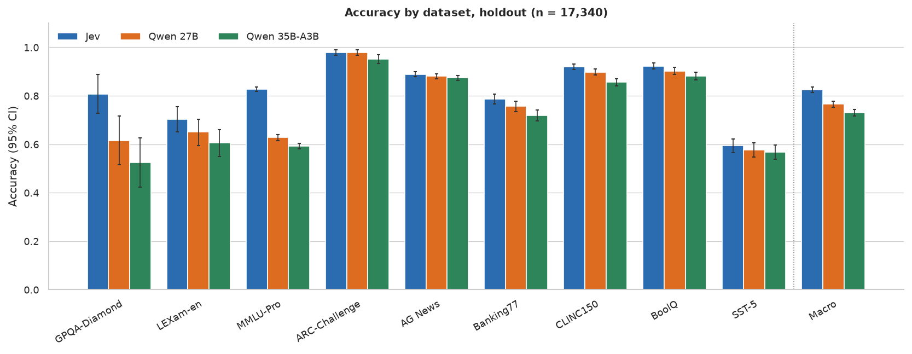

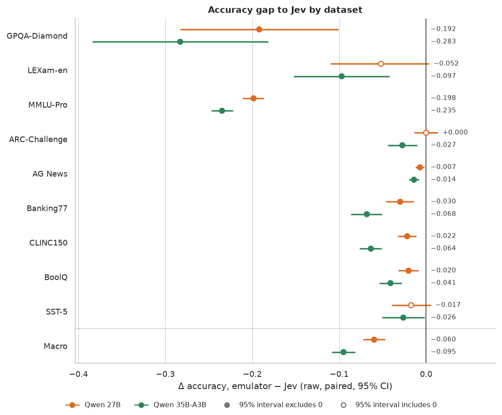

## Results

- Accuracy (macro, paired differences):
  - Qwen 27B trails Jev: -0.0598 [-0.0726, -0.0473]. The largest gaps are MMLU-Pro (-0.198), GPQA-Diamond (-0.192) and LEXam-en (-0.052). On the other 6 benchmarks the gap is at most 0.030. Per benchmark, the 95% interval includes zero on LEXam-en, ARC-Challenge and SST-5.
  - Qwen 35B-A3B trails Jev: -0.0950 [-0.1085, -0.0817]. The largest gaps are GPQA-Diamond (-0.283), MMLU-Pro (-0.235), LEXam-en (-0.097), Banking77 (-0.068) and CLINC150 (-0.064). On the other 4 benchmarks the gap is at most 0.041. Per benchmark, the 95% interval excludes zero everywhere.
  - Between the emulators, Qwen 35B-A3B − Qwen 27B is -0.0352 [-0.0491, -0.0217]. Per benchmark, the 95% interval lies below zero on MMLU-Pro, ARC-Challenge, AG News, Banking77, CLINC150 and BoolQ and includes zero elsewhere.
- Raw macro ECE is 0.072 (Jev), 0.067 (Qwen 27B) and 0.077 (Qwen 35B-A3B). Temperature scaling per signature lowers it to 0.048, 0.035 and 0.037 (point estimates); accuracy is unchanged to four decimals. Mean top probability minus accuracy goes from +0.018 to -0.025 for Jev, from +0.048 to -0.001 for Qwen 27B and from +0.067 to +0.002 for Qwen 35B-A3B.
- Probability quality (calibrated unless marked raw; paired differences):
  - Qwen 27B − Jev is +0.133 [+0.115, +0.151] in NLL and +0.065 [+0.056, +0.074] in Brier (raw: +0.047 [+0.021, +0.073] and +0.065 [+0.056, +0.075]). The largest NLL gaps are MMLU-Pro (+0.477), GPQA-Diamond (+0.290) and Banking77 (+0.204).
  - Qwen 35B-A3B − Jev is +0.280 [+0.258, +0.303] in NLL and +0.108 [+0.097, +0.118] in Brier (raw: +0.197 [+0.166, +0.228] and +0.112 [+0.101, +0.123]). The largest NLL gaps are MMLU-Pro (+0.569), Banking77 (+0.568) and GPQA-Diamond (+0.482).
  - Raw NLL is biased against Jev. Jev rounds its probabilities to 0.01, so on 409 of 17,340 items its probability of the correct answer is exactly 0, clipped to 10<sup>−6</sup> (13.8 nats each). This inflates Jev's raw NLL, so the raw-NLL gaps above understate its lead. With every system's probability of the correct answer floored at 0.005 (half Jev's rounding step), Qwen 27B − Jev is +0.149 and Qwen 35B-A3B − Jev is +0.284. Calibrated NLL is barely affected.
  - Between the emulators, Qwen 35B-A3B − Qwen 27B is +0.147 [+0.127, +0.167] in NLL and +0.043 [+0.034, +0.053] in Brier.
- Cost at the electricity estimate ($0.1107 per GPU-hour):
  - Jev costs $0.0265 per 1k items and $0.0314 per 1k correct answers.
  - Qwen 27B costs $0.0069 per 1k items (26% of Jev's) and $0.0090 per 1k correct answers (29%). It would match Jev's price per item at $0.42 per GPU-hour, and per correct answer at $0.38 (3.8× and 3.5× the electricity-estimate rate).
  - Qwen 35B-A3B costs $0.0015 per 1k items (6% of Jev's) and $0.0021 per 1k correct answers (7%). It would match Jev's price per item at $1.91 per GPU-hour, and per correct answer at $1.68 (17.3× and 15.2× the electricity-estimate rate).
- GPU time by benchmark:
  - CLINC150 and MMLU-Pro take 0.691 of Qwen 27B's 1.084 GPU-hours (64%) for 48% of the items.
  - MMLU-Pro and CLINC150 take 0.135 of Qwen 35B-A3B's 0.240 GPU-hours (56%) for 48% of the items.
- Jev bills 630.7 input tokens per item; Qwen 27B reads 300.9 and Qwen 35B-A3B reads 300.9 prompt tokens. Jev also reports 286.4 output tokens per item (not billed); the emulators generate 1.0 and 1.0 (one per model call).
- Latency per item:
  - Jev: median 135 ms, p95 190 ms.
  - Qwen 27B: median 2,374 ms, p95 9,769 ms. Its slowest benchmarks are CLINC150 (p95 9,772 ms) and Banking77 (p95 7,110 ms); every other benchmark's p95 is under 5.2 s.
  - Qwen 35B-A3B: median 581 ms, p95 1,755 ms. Its slowest benchmarks are GPQA-Diamond (p95 2,136 ms) and CLINC150 (p95 1,766 ms); every other benchmark's p95 is under 1.3 s.
- Throughput, with the emulators on one RTX 3090 (24 GB):
  - Qwen 27B answers 4.44 q/s pooled with 16 items in flight: from 1.65 (CLINC150) to 13.52 (SST-5) by dataset.
  - Qwen 35B-A3B answers 20.07 q/s pooled with 16 items in flight: from 9.25 (CLINC150) to 38.29 (BoolQ) by dataset.
  - Pooled, Qwen 35B-A3B is 4.52× as fast as Qwen 27B.
  - Jev's 19.56 q/s (16 in flight) is our client's rate limit of 20 requests/s (one question per request); Jev's capacity was not measured †.

## Results by dataset

### Accuracy (`holdout`)

Temperature scaling keeps the order of the options, so accuracy is the same raw and calibrated (to four decimals). The table shows raw. Δ columns are paired.

| Benchmark | n | Jev | Qwen 27B | Qwen 35B-A3B | Δ Qwen 27B − Jev | Δ Qwen 35B-A3B − Jev | Δ Qwen 35B-A3B − Qwen 27B |
| --- | --- | --- | --- | --- | --- | --- | --- |
| gpqa_diamond_idk | 99 | 0.8081 [0.7273, 0.8889] | 0.6162 [0.5152, 0.7172] | 0.5253 [0.4242, 0.6263] | -0.1919 [-0.2828, -0.1010] | -0.2828 [-0.3838, -0.1818] | -0.0909 [-0.1919, +0.0101] |
| lexam_en_idk | 309 | 0.7023 [0.6505, 0.7540] | 0.6505 [0.5955, 0.7023] | 0.6052 [0.5502, 0.6602] | -0.0518 [-0.1100, +0.0032] | -0.0971 [-0.1521, -0.0421] | -0.0453 [-0.1036, +0.0129] |
| mmlu_pro | 6,016 | 0.8273 [0.8178, 0.8366] | 0.6288 [0.6160, 0.6408] | 0.5926 [0.5801, 0.6049] | -0.1985 [-0.2109, -0.1865] | -0.2347 [-0.2470, -0.2222] | -0.0362 [-0.0467, -0.0253] |
| arc_challenge | 586 | 0.9795 [0.9676, 0.9898] | 0.9795 [0.9676, 0.9898] | 0.9522 [0.9334, 0.9693] | +0.0000 [-0.0137, +0.0137] | -0.0273 [-0.0444, -0.0102] | -0.0273 [-0.0427, -0.0119] |
| ag_news | 3,800 | 0.8884 [0.8784, 0.8984] | 0.8813 [0.8711, 0.8913] | 0.8745 [0.8639, 0.8847] | -0.0071 [-0.0124, -0.0021] | -0.0139 [-0.0197, -0.0084] | -0.0068 [-0.0118, -0.0021] |
| banking77 | 1,540 | 0.7864 [0.7656, 0.8065] | 0.7565 [0.7344, 0.7779] | 0.7182 [0.6955, 0.7409] | -0.0299 [-0.0461, -0.0143] | -0.0682 [-0.0864, -0.0506] | -0.0383 [-0.0552, -0.0214] |
| clinc150 | 2,250 | 0.9196 [0.9080, 0.9307] | 0.8978 [0.8853, 0.9102] | 0.8560 [0.8413, 0.8702] | -0.0218 [-0.0324, -0.0111] | -0.0636 [-0.0764, -0.0511] | -0.0418 [-0.0556, -0.0284] |
| boolq | 1,635 | 0.9229 [0.9101, 0.9358] | 0.9028 [0.8887, 0.9168] | 0.8820 [0.8661, 0.8972] | -0.0202 [-0.0318, -0.0086] | -0.0410 [-0.0538, -0.0281] | -0.0208 [-0.0336, -0.0086] |
| sst5 | 1,105 | 0.5937 [0.5647, 0.6226] | 0.5765 [0.5475, 0.6054] | 0.5674 [0.5385, 0.5964] | -0.0172 [-0.0398, +0.0054] | -0.0262 [-0.0507, -0.0018] | -0.0090 [-0.0353, +0.0172] |
| **macro** | 17,340 | 0.8253 [0.8138, 0.8365] | 0.7655 [0.7523, 0.7787] | 0.7304 [0.7169, 0.7438] | -0.0598 [-0.0726, -0.0473] | -0.0950 [-0.1085, -0.0817] | -0.0352 [-0.0491, -0.0217] |

### NLL, Brier and ECE (`holdout`)

Each system's cells show the raw value, then the calibrated one. The Δ columns are paired differences of the calibrated values.

NLL:

| Benchmark | Jev, raw → cal. | Qwen 27B, raw → cal. | Qwen 35B-A3B, raw → cal. | Δ Qwen 27B − Jev, cal. | Δ Qwen 35B-A3B − Jev, cal. | Δ Qwen 35B-A3B − Qwen 27B, cal. |
| --- | --- | --- | --- | --- | --- | --- |
| gpqa_diamond_idk | 0.633 → 0.624 | 0.912 → 0.914 | 1.107 → 1.106 | +0.290 [+0.187, +0.400] | +0.482 [+0.341, +0.628] | +0.192 [+0.067, +0.319] |
| lexam_en_idk | 0.797 → 0.770 | 0.857 → 0.860 | 1.011 → 1.013 | +0.090 [-0.002, +0.175] | +0.243 [+0.148, +0.336] | +0.153 [+0.071, +0.232] |
| mmlu_pro | 0.745 → 0.651 | 1.147 → 1.128 | 1.266 → 1.220 | +0.477 [+0.446, +0.507] | +0.569 [+0.538, +0.598] | +0.092 [+0.073, +0.111] |
| arc_challenge | 0.097 → 0.085 | 0.073 → 0.074 | 0.127 → 0.134 | -0.010 [-0.042, +0.018] | +0.049 [+0.014, +0.085] | +0.059 [+0.033, +0.086] |
| ag_news | 0.672 → 0.362 | 0.606 → 0.404 | 0.576 → 0.418 | +0.042 [+0.032, +0.052] | +0.056 [+0.045, +0.068] | +0.015 [+0.007, +0.023] |
| banking77 | 1.280 → 0.907 | 1.271 → 1.111 | 1.675 → 1.475 | +0.204 [+0.152, +0.257] | +0.568 [+0.499, +0.638] | +0.364 [+0.301, +0.429] |
| clinc150 | 0.413 → 0.355 | 0.415 → 0.411 | 0.819 → 0.797 | +0.056 [+0.019, +0.094] | +0.443 [+0.380, +0.507] | +0.386 [+0.327, +0.448] |
| boolq | 0.227 → 0.223 | 0.271 → 0.269 | 0.314 → 0.303 | +0.045 [+0.029, +0.061] | +0.079 [+0.061, +0.097] | +0.034 [+0.020, +0.049] |
| sst5 | 1.462 → 1.016 | 1.202 → 1.021 | 1.206 → 1.048 | +0.005 [-0.021, +0.031] | +0.032 [-0.002, +0.065] | +0.027 [-0.003, +0.055] |
| **macro** | 0.703 → 0.555 | 0.750 → 0.688 | 0.900 → 0.835 | +0.133 [+0.115, +0.151] | +0.280 [+0.258, +0.303] | +0.147 [+0.127, +0.167] |

Brier:

| Benchmark | Jev, raw → cal. | Qwen 27B, raw → cal. | Qwen 35B-A3B, raw → cal. | Δ Qwen 27B − Jev, cal. | Δ Qwen 35B-A3B − Jev, cal. | Δ Qwen 35B-A3B − Qwen 27B, cal. |
| --- | --- | --- | --- | --- | --- | --- |
| gpqa_diamond_idk | 0.310 → 0.306 | 0.485 → 0.486 | 0.573 → 0.571 | +0.180 [+0.119, +0.244] | +0.266 [+0.192, +0.343] | +0.086 [+0.022, +0.151] |
| lexam_en_idk | 0.393 → 0.394 | 0.462 → 0.463 | 0.520 → 0.520 | +0.070 [+0.026, +0.113] | +0.126 [+0.083, +0.170] | +0.057 [+0.011, +0.101] |
| mmlu_pro | 0.265 → 0.269 | 0.486 → 0.482 | 0.530 → 0.518 | +0.214 [+0.203, +0.225] | +0.249 [+0.238, +0.260] | +0.036 [+0.028, +0.044] |
| arc_challenge | 0.032 → 0.035 | 0.034 → 0.034 | 0.066 → 0.065 | -0.001 [-0.016, +0.014] | +0.030 [+0.011, +0.050] | +0.031 [+0.015, +0.047] |
| ag_news | 0.189 → 0.179 | 0.206 → 0.190 | 0.216 → 0.197 | +0.011 [+0.007, +0.015] | +0.018 [+0.014, +0.023] | +0.008 [+0.004, +0.011] |
| banking77 | 0.326 → 0.312 | 0.373 → 0.361 | 0.431 → 0.415 | +0.049 [+0.035, +0.063] | +0.103 [+0.085, +0.121] | +0.054 [+0.038, +0.071] |
| clinc150 | 0.126 → 0.126 | 0.151 → 0.151 | 0.229 → 0.230 | +0.025 [+0.013, +0.037] | +0.103 [+0.089, +0.119] | +0.079 [+0.063, +0.095] |
| boolq | 0.127 → 0.125 | 0.154 → 0.154 | 0.180 → 0.179 | +0.029 [+0.018, +0.039] | +0.054 [+0.043, +0.065] | +0.025 [+0.015, +0.036] |
| sst5 | 0.600 → 0.551 | 0.604 → 0.558 | 0.631 → 0.570 | +0.007 [-0.005, +0.019] | +0.020 [+0.005, +0.035] | +0.013 [-0.004, +0.029] |
| **macro** | 0.263 → 0.255 | 0.328 → 0.320 | 0.375 → 0.363 | +0.065 [+0.056, +0.074] | +0.108 [+0.097, +0.118] | +0.043 [+0.034, +0.053] |

ECE (top label, 10 equal-mass bins, point estimates). GPQA has only 99 items, so each bin holds about 10 and its ECE is noisy (noise floor about 0.11):

| Benchmark | n | Jev, raw → cal. | Qwen 27B, raw → cal. | Qwen 35B-A3B, raw → cal. | Δ Qwen 27B − Jev, raw / cal. | Δ Qwen 35B-A3B − Jev, raw / cal. | Δ Qwen 35B-A3B − Qwen 27B, raw / cal. |
| --- | --- | --- | --- | --- | --- | --- | --- |
| gpqa_diamond_idk | 99 | 0.131 → 0.121 | 0.108 → 0.116 | 0.088 → 0.100 | -0.024 / -0.006 | -0.044 / -0.022 | -0.020 / -0.016 |
| lexam_en_idk | 309 | 0.089 → 0.076 | 0.035 → 0.060 | 0.049 → 0.050 | -0.054 / -0.015 | -0.040 / -0.025 | +0.014 / -0.010 |
| mmlu_pro | 6,016 | 0.047 → 0.062 | 0.053 → 0.017 | 0.091 → 0.015 | +0.005 / -0.046 | +0.044 / -0.047 | +0.039 / -0.002 |
| arc_challenge | 586 | 0.008 → 0.024 | 0.019 → 0.020 | 0.019 → 0.020 | +0.011 / -0.004 | +0.011 / -0.005 | -0.000 / -0.000 |
| ag_news | 3,800 | 0.067 → 0.019 | 0.084 → 0.018 | 0.087 → 0.020 | +0.018 / -0.002 | +0.020 / +0.001 | +0.003 / +0.003 |
| banking77 | 1,540 | 0.095 → 0.046 | 0.099 → 0.014 | 0.109 → 0.029 | +0.005 / -0.032 | +0.015 / -0.018 | +0.010 / +0.015 |
| clinc150 | 2,250 | 0.013 → 0.009 | 0.017 → 0.014 | 0.022 → 0.022 | +0.004 / +0.005 | +0.010 / +0.014 | +0.005 / +0.009 |
| boolq | 1,635 | 0.030 → 0.018 | 0.020 → 0.018 | 0.024 → 0.019 | -0.009 / -0.000 | -0.006 / +0.001 | +0.004 / +0.001 |
| sst5 | 1,105 | 0.168 → 0.053 | 0.167 → 0.039 | 0.200 → 0.055 | -0.001 / -0.014 | +0.032 / +0.001 | +0.033 / +0.015 |
| **macro** | 17,340 | 0.072 → 0.048 | 0.067 → 0.035 | 0.077 → 0.037 | -0.005 / -0.013 | +0.005 / -0.011 | +0.010 / +0.002 |

### Reliability (`holdout`)

Each diagram plots accuracy against mean top probability in 10 equal-mass bins, raw and calibrated. The diagonal is perfect calibration. Marker area is proportional to a bin's item count. The strip under each diagram is a histogram of top probability (0.05-wide bins, share of items).

The overall figure pools all 17,340 items into one set of bins, so its pooled ECE differs from the tables' macro ECE (the mean of the per-benchmark ECEs). The per-dataset figures show the bins behind each benchmark's ECE. GPQA-Diamond has 99 `holdout` items, so its bins hold about 10 items each.

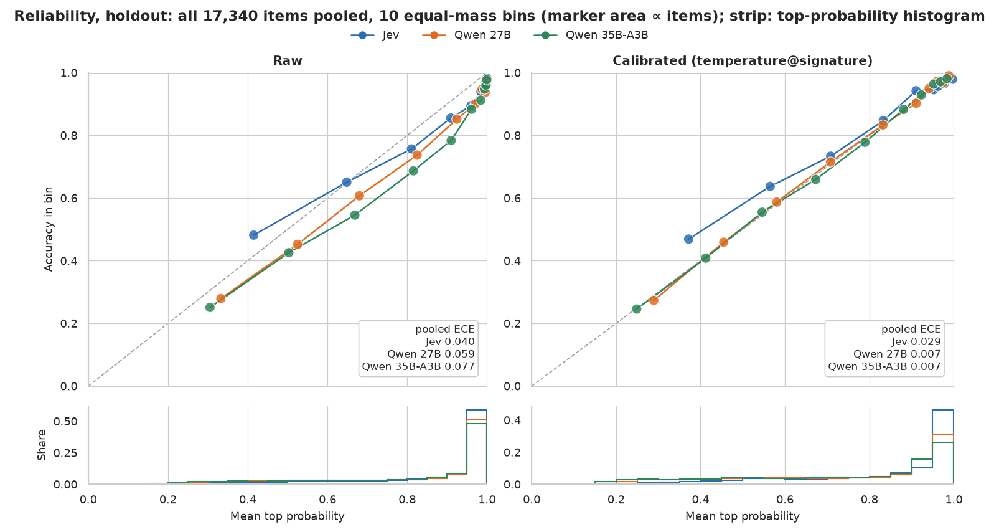

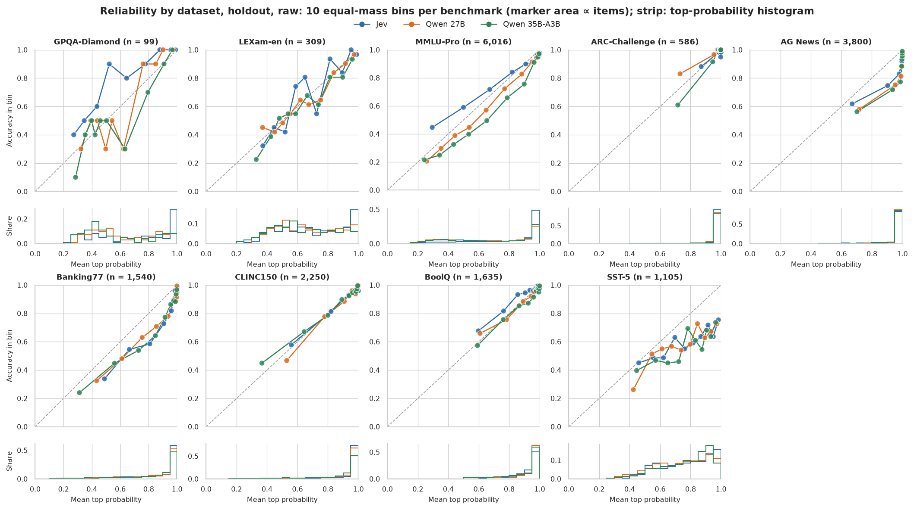

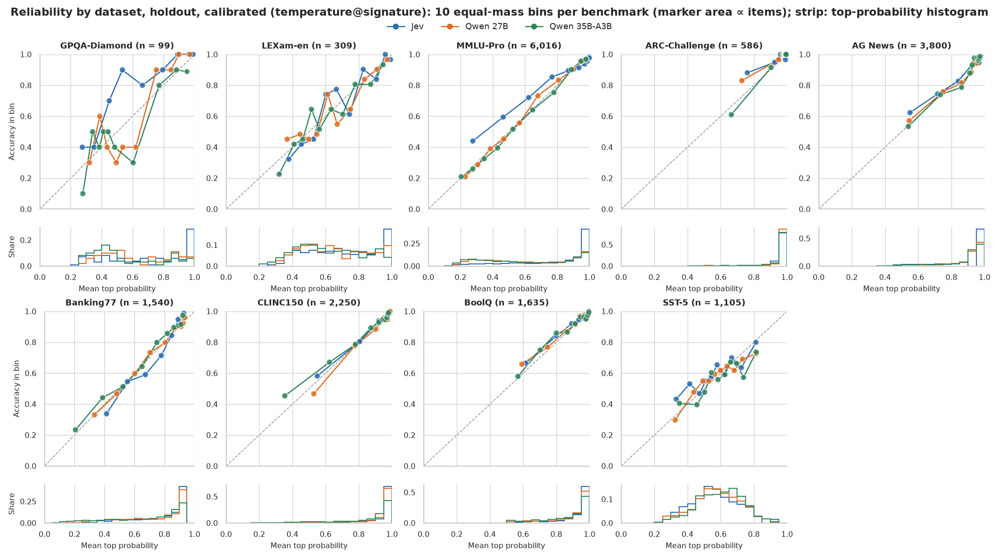

### Confidence (`holdout`)

Mean top probability, raw and then calibrated:

| Benchmark | Jev, raw → cal. | Qwen 27B, raw → cal. | Qwen 35B-A3B, raw → cal. |
| --- | --- | --- | --- |
| gpqa_diamond_idk | 0.677 → 0.687 | 0.627 → 0.624 | 0.568 → 0.551 |
| lexam_en_idk | 0.694 → 0.705 | 0.664 → 0.660 | 0.642 → 0.620 |
| mmlu_pro | 0.813 → 0.789 | 0.681 → 0.628 | 0.684 → 0.602 |
| arc_challenge | 0.985 → 0.960 | 0.961 → 0.959 | 0.961 → 0.943 |
| ag_news | 0.955 → 0.881 | 0.966 → 0.881 | 0.961 → 0.877 |
| banking77 | 0.881 → 0.787 | 0.856 → 0.751 | 0.828 → 0.693 |
| clinc150 | 0.929 → 0.914 | 0.914 → 0.906 | 0.855 → 0.838 |
| boolq | 0.893 → 0.914 | 0.913 → 0.894 | 0.906 → 0.873 |
| sst5 | 0.762 → 0.567 | 0.744 → 0.581 | 0.767 → 0.597 |
| **macro** | 0.843 → 0.800 | 0.814 → 0.765 | 0.797 → 0.733 |

The same NLL and ECE numbers as bar charts:

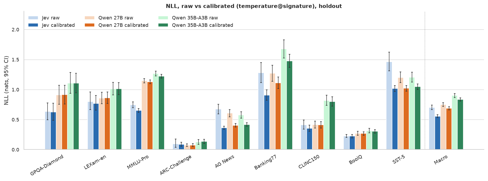

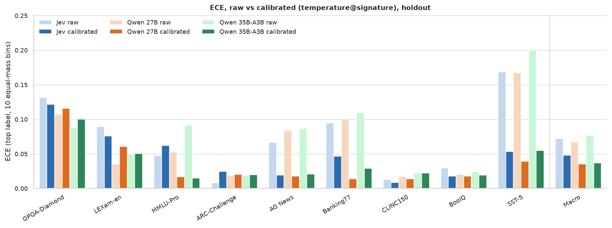

### Tokens, latency and throughput (`select`)

Cells are Jev / Qwen 27B / Qwen 35B-A3B.

- An emulator's tokens are the prompt and generated tokens of its one model call per item. Jev's are the tokens it reports; input is billed and output is not.
- Latency is per item, at each system's items in flight (Jev 16, Qwen 27B 16 and Qwen 35B-A3B 16).
- Throughput (q/s) is the items a run answered divided by its summed wall time (vLLM server startup excluded).

| Benchmark | Items | In tok/item | Out tok/item | p50 ms | p95 ms | q/s |
| --- | --- | --- | --- | --- | --- | --- |
| gpqa_diamond_idk | 99 | 595.1 / 316.9 / 316.9 | 52.0 / 1.0 / 1.0 | 149 / 3,507 / 854 | 857 / 5,187 / 2,136 | 15.97 † / 4.20 / 15.16 |
| lexam_en_idk | 310 | 515.3 / 241.6 / 241.6 | 52.0 / 1.0 / 1.0 | 133 / 2,883 / 611 | 181 / 3,014 / 847 | 19.87 † / 5.64 / 25.25 |
| mmlu_pro | 6,016 | 554.6 / 250.8 / 250.8 | 83.4 / 1.0 / 1.0 | 131 / 2,808 / 607 | 175 / 4,769 / 908 | 19.99 † / 5.36 / 24.66 |
| arc_challenge | 586 | 380.9 / 109.8 / 109.8 | 45.0 / 1.0 / 1.0 | 134 / 1,393 / 568 | 177 / 1,630 / 586 | 19.94 † / 11.26 / 28.77 |
| ag_news | 3,800 | 358.4 / 109.9 / 109.9 | 47.4 / 1.0 / 1.0 | 139 / 1,373 / 569 | 198 / 1,607 / 593 | 19.98 † / 11.26 / 28.65 |
| banking77 | 1,540 | 1,023.6 / 581.5 / 581.5 | 828.3 / 1.0 / 1.0 | 138 / 6,737 / 1,230 | 198 / 7,110 / 1,242 | 16.33 † / 2.34 / 12.56 |
| clinc150 | 2,250 | 1,416.0 / 827.0 / 827.0 | 1,293.5 / 1.0 / 1.0 | 139 / 9,769 / 1,747 | 208 / 9,772 / 1,766 | 19.94 † / 1.65 / 9.25 |
| boolq | 1,635 | 403.8 / 163.9 / 163.9 | 20.0 / 1.0 / 1.0 | 132 / 2,033 / 410 | 197 / 2,366 / 504 | 19.98 † / 7.93 / 38.29 |
| sst5 | 1,105 | 338.7 / 88.0 / 88.0 | 17.0 / 1.0 / 1.0 | 134 / 1,137 / 576 | 183 / 1,333 / 603 | 19.96 † / 13.52 / 28.03 |
| **all (pooled)** | 17,341 | 630.7 / 300.9 / 300.9 | 286.4 / 1.0 / 1.0 | 135 / 2,374 / 581 | 190 / 9,769 / 1,755 | 19.56 † / 4.44 / 20.07 |

† Jev's q/s is set by our client's rate limit. The runs sent one question per request, and JevClient caps request starts at max_rpm = 1,200/min (20 requests/s), which is Jev's documented limit (1,200 requests/min and 250,000 tokens/s). Jev evaluates the questions of one request in parallel, so with N questions per request its ceiling is about 20·N q/s, up to 250,000 tokens/s (about 500 q/s at 500 tokens per question). This ceiling comes from the docs; we did not measure it.

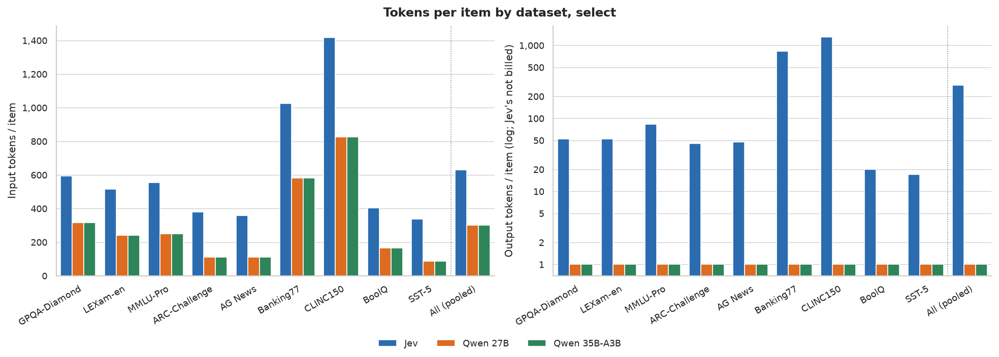

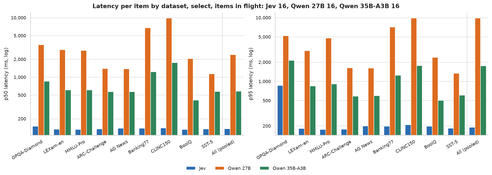

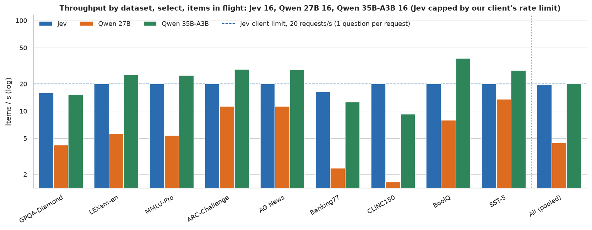

### Cost (`select`)

Cells are Jev / Qwen 27B / Qwen 35B-A3B; GPU-h is Qwen 27B / Qwen 35B-A3B. An emulator's GPU time for a benchmark is the wall time of the run that answered it, priced at the electricity estimate.

| Benchmark | Items | Cost $ | GPU-h | $ / 1k items | $ / 1k correct | Qwen 27B / Jev per item | Qwen 35B-A3B / Jev per item |
| --- | --- | --- | --- | --- | --- | --- | --- |
| gpqa_diamond_idk | 99 | 0.0025 / 0.0007 / 0.0002 | 0.007 / 0.002 | 0.0250 / 0.0073 / 0.0020 | 0.0387 / 0.0154 / 0.0046 | 0.29 | 0.08 |
| lexam_en_idk | 310 | 0.0067 / 0.0017 / 0.0004 | 0.015 / 0.003 | 0.0216 / 0.0055 / 0.0012 | 0.0290 / 0.0081 / 0.0019 | 0.25 | 0.06 |
| mmlu_pro | 6,016 | 0.1401 / 0.0345 / 0.0075 | 0.312 / 0.068 | 0.0233 / 0.0057 / 0.0012 | 0.0282 / 0.0091 / 0.0021 | 0.25 | 0.05 |
| arc_challenge | 586 | 0.0094 / 0.0016 / 0.0006 | 0.014 / 0.006 | 0.0160 / 0.0027 / 0.0011 | 0.0164 / 0.0028 / 0.0011 | 0.17 | 0.07 |
| ag_news | 3,800 | 0.0572 / 0.0104 / 0.0041 | 0.094 / 0.037 | 0.0151 / 0.0027 / 0.0011 | 0.0170 / 0.0031 / 0.0012 | 0.18 | 0.07 |
| banking77 | 1,540 | 0.0662 / 0.0203 / 0.0038 | 0.183 / 0.034 | 0.0430 / 0.0132 / 0.0024 | 0.0535 / 0.0168 / 0.0033 | 0.31 | 0.06 |
| clinc150 | 2,250 | 0.1338 / 0.0420 / 0.0075 | 0.380 / 0.068 | 0.0595 / 0.0187 / 0.0033 | 0.0644 / 0.0210 / 0.0039 | 0.31 | 0.06 |
| boolq | 1,635 | 0.0277 / 0.0063 / 0.0013 | 0.057 / 0.012 | 0.0170 / 0.0039 / 0.0008 | 0.0187 / 0.0044 / 0.0009 | 0.23 | 0.05 |
| sst5 | 1,105 | 0.0157 / 0.0025 / 0.0012 | 0.023 / 0.011 | 0.0142 / 0.0023 / 0.0011 | 0.0247 / 0.0040 / 0.0019 | 0.16 | 0.08 |
| **all (pooled)** | 17,341 | 0.4594 / 0.1200 / 0.0266 | 1.084 / 0.240 | 0.0265 / 0.0069 / 0.0015 | 0.0314 / 0.0090 / 0.0021 | 0.26 | 0.06 |

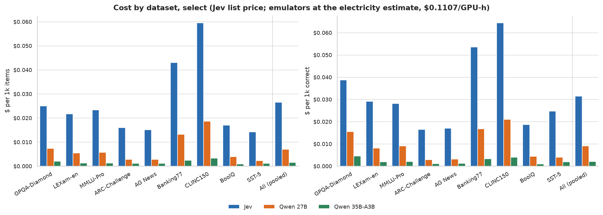

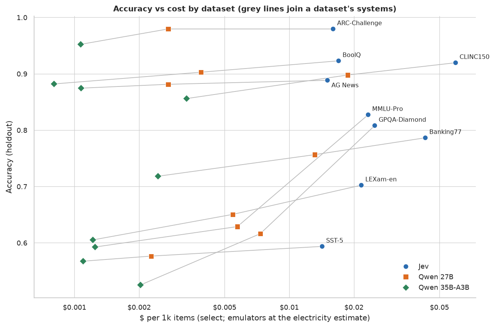

### Cost check against the `holdout` runs

This table puts the `select` runs used above next to the `holdout` runs of the same systems. Each system's two rows come from one run directory, so they measure one configuration on disjoint items.

| Run | Items | In flight | In tok/item | p50 ms | p95 ms | q/s | GPU-h | Cost $ | $ / 1k items |
| --- | --- | --- | --- | --- | --- | --- | --- | --- | --- |
| Jev, `select` (used) | 17,341 | 16 | 630.7 | 135 | 190 | 19.56 † |  | 0.4594 | 0.0265 |
| Jev, `holdout` | 17,340 | 16 | 630.7 | 138 | 187 | 19.97 † |  | 0.4593 | 0.0265 |
| Qwen 27B, `select` (used) | 17,341 | 16 | 300.9 | 2,374 | 9,769 | 4.44 | 1.084 | 0.1200 | 0.0069 |
| Qwen 27B, `holdout` | 17,340 | 16 | 301.1 | 2,355 | 9,768 | 4.44 | 1.085 | 0.1202 | 0.0069 |
| Qwen 35B-A3B, `select` (used) | 17,341 | 16 | 300.9 | 581 | 1,755 | 20.07 | 0.240 | 0.0266 | 0.0015 |
| Qwen 35B-A3B, `holdout` | 17,340 | 16 | 301.1 | 586 | 1,758 | 19.70 | 0.244 | 0.0271 | 0.0016 |

† Jev's q/s is set by our client's rate limit. The runs sent one question per request, and JevClient caps request starts at max_rpm = 1,200/min (20 requests/s), which is Jev's documented limit (1,200 requests/min and 250,000 tokens/s). Jev evaluates the questions of one request in parallel, so with N questions per request its ceiling is about 20·N q/s, up to 250,000 tokens/s (about 500 q/s at 500 tokens per question). This ceiling comes from the docs; we did not measure it.

## Caveats

- The electricity price is a placeholder. The 410 W average draw is an assumption and was not measured; $0.00027/Wh is the New Jersey average. The estimate leaves out the GPU's purchase price, the rest of the machine and cooling. With those, a local emulator may cost more than Jev. The break-even rates above show how much headroom there is.
- The latency numbers are not directly comparable. An emulator's latency is the end-to-end time of one item on one RTX 3090 (24 GB), sharing the server with the other items in flight. Jev's is the HTTP round trip over the internet from the same client. Items in flight: Jev 16, Qwen 27B 16 and Qwen 35B-A3B 16. Each emulator's GPU time per item was measured at this concurrency only.
- Neither Qwen model fits in the GPU's 24 GB with 16-bit weights (27B: about 54 GB; 35B-A3B: about 70 GB), so both run quantized builds: `QuantTrio/Qwen3.6-27B-AWQ` (Qwen 27B) and `QuantTrio/Qwen3.6-35B-A3B-AWQ` (Qwen 35B-A3B). Another 4-bit build of the 27B model (cyankiwi) is statistically tied with QuantTrio's; see the calibration study.
- Quality is measured on `holdout` and cost on `select`. The two halves share the benchmarks and prompt template but have disjoint items. Jev's cost per 1k items is $0.0265 on `select` and $0.0265 on `holdout`. $ / 1k correct uses the answers on `select` (macro accuracy 0.8098 Jev, 0.7520 Qwen 27B and 0.7264 Qwen 35B-A3B, scoring each system's returned answer).
- The calibrated numbers are out of fold: each fold's temperatures are fitted on the other four folds of this holdout half. Qwen 27B's deployed registry (`calibration/qwen3.6-27b-int4-quanttrio/registry.json`) is fitted on its whole holdout run. Qwen 35B-A3B's deployed registry (`calibration/qwen3.6-35b-a3b-fast/registry.json`) is fitted on its whole holdout run. New question types fall back to one global temperature.
- Accuracy uses the first argmax of the renormalized probabilities (the first option with the highest probability), for every system. `run_split.py summarize` scores Jev's returned `choice` instead, which differs on near-ties (macro 0.8250 vs 0.8253 on `holdout`).
- The $ / 1k items and $ / 1k correct rows pool all items, while macro accuracy weighs every benchmark equally.

## Regenerate

```bash
uv run --extra plot python scripts/make_report.py
```

The inputs are the gitignored `runs/` artifacts listed in the script's docstring. The report holds only aggregates, with no question text or per-item outputs.
