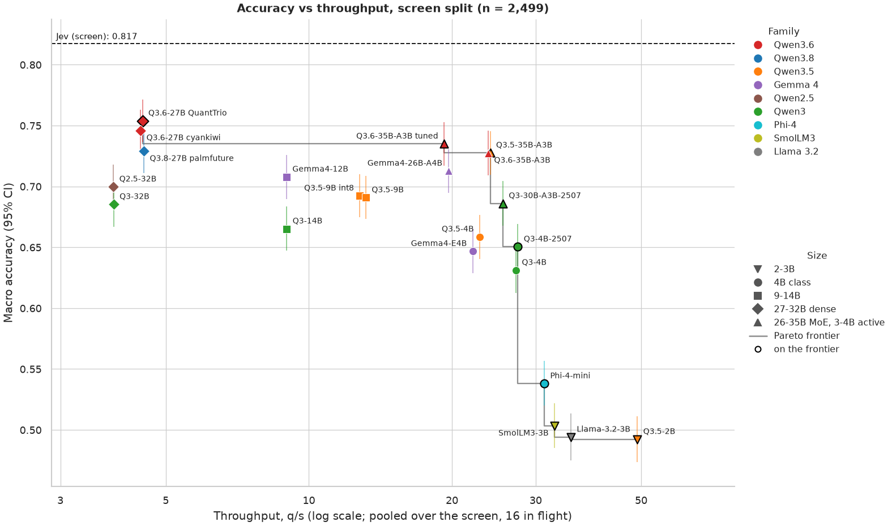
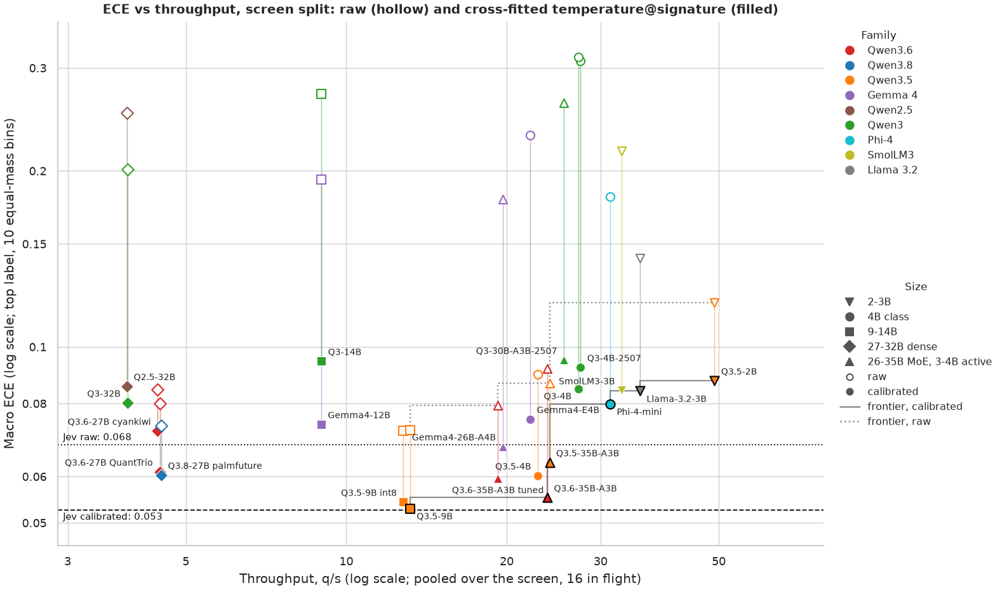
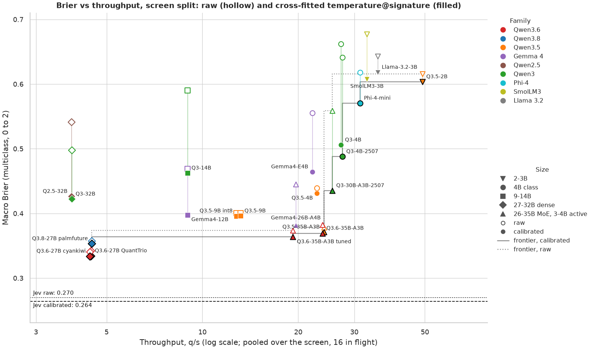
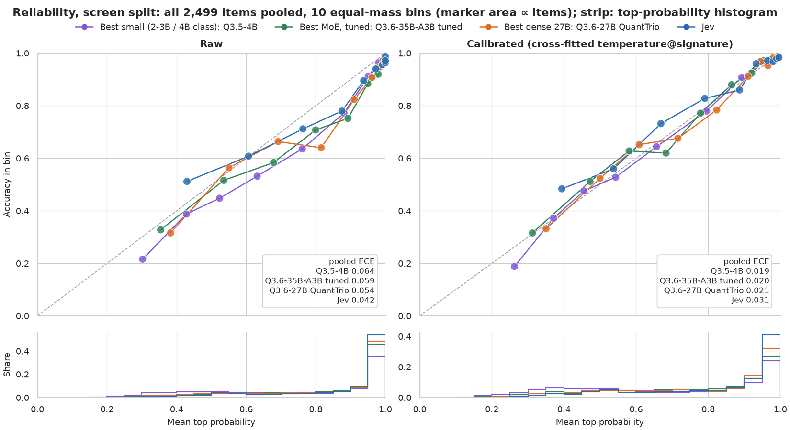
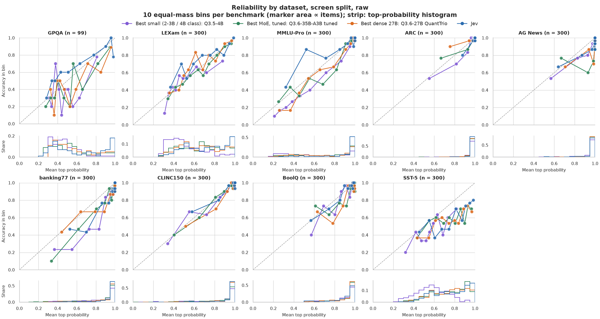
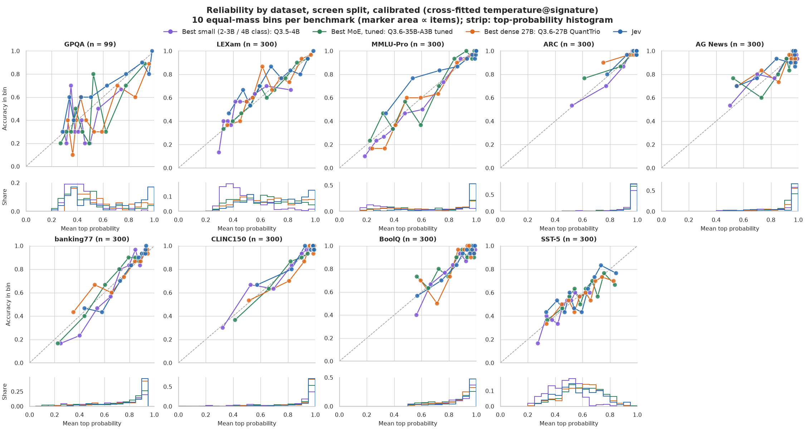

# Speed/quality trade-off: every emulator candidate on the screen split

Every emulator candidate answered the same 2,499 `screen` items from 9 benchmarks (99 for GPQA-Diamond, 300 for each other). The plots show one point per candidate: throughput on x, quality on y. Method and candidate notes: [docs/research/selection.md](../../docs/research/selection.md) ("Speed/quality trade-off") and [docs/research/candidates.md](../../docs/research/candidates.md).

All runs used the same settings: `state_first` layout, `auto_single` scoring, no debiaser, 16 items in flight, one vLLM 0.30.0 server on one RTX 3090 (24 GB), and a fresh container per run. Every question is one model call. Questions with more than 32 options are labelled with two-capital single-token codes (AA, AB, …) instead of letters.

- Yelp review stars is left out because of its label wording. Macro averages cover the other 9 benchmarks; docs/research/* keep the 10-benchmark numbers.
- q/s (questions per second) is pooled: all items sent (response-cache hits excluded) divided by the summed wall time of the runner invocations (server startup excluded), at 16 in flight. p50 and p95 are the median and 95th-percentile latency per item under that load.
- Accuracy is macro (each benchmark weighs 1/9), with a 95% stratified bootstrap interval. An "I don't know" answer counts as wrong.
- ECE (expected calibration error: top label, 10 equal-mass bins) and Brier score (multiclass, 0 to 2) are macro averages; lower is better. Raw means the recorded probabilities. Calibrated means `temperature@signature`, cross-fitted in 5 folds on these screen items, with every system on the same folds.
- Calibration is out of sample: each item is calibrated by a fit that never saw it, so the numbers carry no in-sample optimism. The setup differs from the holdout study ([calibration.md](../../docs/research/calibration.md)) only in its smaller n: about 2,240 training items per fold instead of a whole split. The per-signature temperatures are therefore noisier, and ECE on 300-item benchmarks carries more binning noise.
- Jev is the horizontal reference line in the plots. Its screen answers are replayed from the response cache, so it has no screen q/s. Its measured `select` q/s (19.6) is our client's rate limit (†).
- Jev's accuracy here counts its returned `choice`, as `run_split.py summarize` does. [reports/summary](../summary/index.html) scores every system by the argmax of its probabilities, which gives Jev 0.8204 on these items. The two differ only on near-ties.
- A candidate is on a Pareto frontier when no other candidate is both at least as fast and at least as good. Depending on the frontier, better means higher accuracy, lower calibrated ECE or lower calibrated Brier.

## Findings

1. Q3.6-27B QuantTrio is the most accurate candidate: 0.7538 macro accuracy at 4.47 q/s. Jev scores 0.8174 on the same items. The fastest candidate, Q3.5-2B, answers 49.1 q/s at 0.4922.
2. The accuracy frontier, from slowest to fastest: Q3.6-27B QuantTrio (0.754 at 4.47 q/s), Q3.6-35B-A3B tuned (0.735 at 19.3 q/s), Q3.5-35B-A3B (0.728 at 24.1 q/s), Q3-30B-A3B-2507 (0.686 at 25.6 q/s), Q3-4B-2507 (0.650 at 27.5 q/s), Phi-4-mini (0.538 at 31.3 q/s), SmolLM3-3B (0.503 at 32.9 q/s), Llama-3.2-3B (0.494 at 35.6 q/s), Q3.5-2B (0.492 at 49.1 q/s).
3. Q3.5-4B is the best small model (≤ 4B class): 0.6586 at 22.9 q/s, −0.0953 against Q3.6-27B QuantTrio.
4. Most accurate candidate per speed tier (accuracy, and Δ against the most accurate candidate overall):
   - ≥ 5 q/s: Q3.6-35B-A3B tuned, 0.735 (−0.019 [−0.035, −0.003])
   - ≥ 10 q/s: Q3.6-35B-A3B tuned, 0.735 (−0.019 [−0.035, −0.003])
   - ≥ 20 q/s: Q3.5-35B-A3B, 0.728 (−0.026 [−0.044, −0.009])
   - ≥ 30 q/s: Phi-4-mini, 0.538 (−0.216 [−0.238, −0.195])
5. Accuracy cost of each step down the frontier (paired on the screen items):
   - Q3.6-27B QuantTrio to Q3.6-35B-A3B tuned: 4.3× faster, −0.019 [−0.035, −0.003] accuracy
   - Q3.6-35B-A3B tuned to Q3.5-35B-A3B: 1.2× faster, −0.007 [−0.022, +0.007] accuracy
   - Q3.5-35B-A3B to Q3-30B-A3B-2507: 1.1× faster, −0.042 [−0.062, −0.021] accuracy
   - Q3-30B-A3B-2507 to Q3-4B-2507: 1.1× faster, −0.036 [−0.055, −0.016] accuracy
   - Q3-4B-2507 to Phi-4-mini: 1.1× faster, −0.112 [−0.133, −0.092] accuracy
   - Phi-4-mini to SmolLM3-3B: 1.1× faster, −0.035 [−0.057, −0.012] accuracy
   - SmolLM3-3B to Llama-3.2-3B: 1.1× faster, −0.009 [−0.032, +0.013] accuracy
   - Llama-3.2-3B to Q3.5-2B: 1.4× faster, −0.002 [−0.025, +0.021] accuracy
6. Cross-fitted `temperature@signature` brings every candidate's macro ECE into the range 0.053 to 0.095 (Jev: 0.068 raw, 0.053 calibrated). Candidates whose raw ECE is above 0.15 and more than halved by calibration: Gemma4-26B-A4B (0.179 to 0.068), Gemma4-12B (0.193 to 0.074), Q2.5-32B (0.251 to 0.086), Q3-30B-A3B-2507 (0.261 to 0.095), Q3-32B (0.201 to 0.080), Q3-14B (0.271 to 0.095), Q3-4B-2507 (0.308 to 0.092), Gemma4-E4B (0.230 to 0.075), Q3-4B (0.313 to 0.085), Phi-4-mini (0.181 to 0.080), SmolLM3-3B (0.216 to 0.084).

## Accuracy



## Calibration





## All candidates

Ranked by macro accuracy. Bold names are on the accuracy frontier. The Frontier column lists the frontiers a candidate is on: accuracy, calibrated ECE, calibrated Brier.

| # | Model | Preset | Params | Weights | Macro acc. [95% CI] | q/s | p50 ms | p95 ms | ECE raw | ECE cal. | Brier raw | Brier cal. | Frontier |
| --- | --- | --- | --- | --- | --- | --- | --- | --- | --- | --- | --- | --- | --- |
| 1 | **Q3.6-27B QuantTrio** | `qwen3.6-27b-int4-quanttrio` | 27B | INT4 AWQ | 0.7538 [0.7365, 0.7712] | 4.47 | 2,334 | 9,754 | 0.080 | 0.061 | 0.342 | 0.334 | acc., Brier |
| 2 | Q3.6-27B cyankiwi | `qwen3.6-27b-int4-cyankiwi` | 27B | INT4 AWQ | 0.7460 [0.7292, 0.7632] | 4.43 | 2,274 | 9,834 | 0.084 | 0.072 | 0.341 | 0.334 | Brier |
| 3 | **Q3.6-35B-A3B tuned** | `qwen3.6-35b-a3b-fast` | 35B-A3B | INT4 AWQ | 0.7349 [0.7171, 0.7528] | 19.3 | 552 | 1,733 | 0.079 | 0.060 | 0.374 | 0.364 | acc., Brier |
| 4 | Q3.8-27B palmfuture | `qwen3.8-27b-int4-palmfuture` | 27B | INT4 GPTQ | 0.7290 [0.7108, 0.7468] | 4.50 | 2,280 | 9,703 | 0.073 | 0.060 | 0.358 | 0.353 | Brier |
| 5 | **Q3.5-35B-A3B** | `qwen3.5-35b-a3b-int4` | 35B-A3B | INT4 GPTQ | 0.7276 [0.7098, 0.7454] | 24.1 | 426 | 1,656 | 0.087 | 0.063 | 0.378 | 0.371 | acc., ECE, Brier |
| 6 | Q3.6-35B-A3B | `qwen3.6-35b-a3b-int4-palmfuture` | 35B-A3B | INT4 GPTQ | 0.7272 [0.7093, 0.7457] | 23.8 | 421 | 1,651 | 0.092 | 0.055 | 0.383 | 0.369 | ECE, Brier |
| 7 | Gemma4-26B-A4B | `gemma-4-26b-a4b-int4-cyankiwi` | 26B-A4B | INT4 QAT (AWQ/W4A16) | 0.7127 [0.6948, 0.7305] | 19.7 | 418 | 2,280 | 0.179 | 0.068 | 0.445 | 0.382 |  |
| 8 | Gemma4-12B | `gemma-4-12b-int4` | 12B | INT4 QAT (W4A16) | 0.7078 [0.6896, 0.7259] | 8.97 | 965 | 5,161 | 0.193 | 0.074 | 0.469 | 0.398 |  |
| 9 | Q2.5-32B | `qwen2.5-32b-int4` | 32B | INT4 AWQ | 0.6997 [0.6815, 0.7179] | 3.88 | 2,477 | 11,726 | 0.251 | 0.086 | 0.541 | 0.426 |  |
| 10 | Q3.5-9B int8 | `qwen3.5-9b-int8` | 9B | INT8 W8A16 | 0.6922 [0.6748, 0.7101] | 12.8 | 755 | 3,346 | 0.072 | 0.054 | 0.400 | 0.396 |  |
| 11 | Q3.5-9B | `qwen3.5-9b-bf16` | 9B | bf16 | 0.6908 [0.6733, 0.7086] | 13.2 | 752 | 3,375 | 0.072 | 0.053 | 0.400 | 0.396 | ECE |
| 12 | **Q3-30B-A3B-2507** | `qwen3-30b-a3b-2507-int4-redhat` | 30B-A3B | INT4 W4A16 | 0.6860 [0.6677, 0.7046] | 25.6 | 358 | 1,699 | 0.261 | 0.095 | 0.559 | 0.435 | acc., Brier |
| 13 | Q3-32B | `qwen3-32b-int4` | 32B | INT4 AWQ | 0.6853 [0.6669, 0.7038] | 3.88 | 2,545 | 11,753 | 0.201 | 0.080 | 0.498 | 0.422 |  |
| 14 | Q3-14B | `qwen3-14b-int4` | 14B | INT4 AWQ | 0.6652 [0.6474, 0.6834] | 8.98 | 1,081 | 5,021 | 0.271 | 0.095 | 0.590 | 0.462 |  |
| 15 | Q3.5-4B | `qwen3.5-4b-bf16` | 4B | bf16 | 0.6586 [0.6404, 0.6768] | 22.9 | 444 | 1,821 | 0.090 | 0.060 | 0.439 | 0.431 |  |
| 16 | **Q3-4B-2507** | `qwen3-4b-2507-bf16` | 4B | bf16 | 0.6504 [0.6322, 0.6690] | 27.5 | 334 | 1,540 | 0.308 | 0.092 | 0.641 | 0.488 | acc., Brier |
| 17 | Gemma4-E4B | `gemma-4-e4b-bf16` | E4B (8B with PLE) | bf16 | 0.6467 [0.6285, 0.6653] | 22.1 | 377 | 2,009 | 0.230 | 0.075 | 0.555 | 0.464 |  |
| 18 | Q3-4B | `qwen3-4b-bf16` | 4B | bf16 | 0.6312 [0.6126, 0.6501] | 27.3 | 341 | 1,540 | 0.313 | 0.085 | 0.662 | 0.506 |  |
| 19 | **Phi-4-mini** | `phi-4-mini-bf16` | 3.8B | bf16 | 0.5380 [0.5202, 0.5565] | 31.3 | 286 | 1,358 | 0.181 | 0.080 | 0.618 | 0.570 | acc., ECE, Brier |
| 20 | **SmolLM3-3B** | `smollm3-3b-bf16` | 3B | bf16 | 0.5034 [0.4852, 0.5220] | 32.9 | 275 | 1,241 | 0.216 | 0.084 | 0.677 | 0.608 | acc. |
| 21 | **Llama-3.2-3B** | `llama-3.2-3b-bf16` | 3.2B | bf16 | 0.4941 [0.4751, 0.5134] | 35.6 | 252 | 1,183 | 0.142 | 0.084 | 0.643 | 0.618 | acc., ECE |
| 22 | **Q3.5-2B** | `qwen3.5-2b-bf16` | 2B | bf16 | 0.4922 [0.4737, 0.5112] | 49.1 | 196 | 792 | 0.119 | 0.088 | 0.616 | 0.603 | acc., ECE, Brier |
|  | **Jev** | `jev` |  |  | 0.8174 [0.8013, 0.8337] | — (19.6 †) | 135 † |  | 0.068 | 0.053 | 0.270 | 0.264 |  |

† Jev's q/s is set by our client's rate limit. The runs sent one question per request, and JevClient caps request starts at max_rpm = 1,200/min (20 requests/s), which is Jev's documented limit (1,200 requests/min and 250,000 tokens/s). Jev evaluates the questions of one request in parallel, so with N questions per request its ceiling is about 20·N q/s, up to 250,000 tokens/s (about 500 q/s at 500 tokens per question). This ceiling comes from the docs; we did not measure it.

## Calibration and reliability of four systems

This section compares four systems on the same 2,499 `screen` items: the most accurate small model (2 to 3B or 4B class), the best MoE (mixture-of-experts) model, the most accurate dense 27B model, and Jev. The calibrated values use the same cross-fitted `temperature@signature` as the table above. NLL is the negative log-likelihood of the correct answer. Mean top probability minus accuracy is the overconfidence that the reliability diagrams show.

| Role | Model | Preset | Macro acc. [95% CI] | NLL raw → cal. | Brier raw → cal. | ECE raw → cal. | Mean top p − acc., raw → cal. | q/s | p50 ms | In flight |
| --- | --- | --- | --- | --- | --- | --- | --- | --- | --- | --- |
| Best small (2-3B / 4B class) | Q3.5-4B | `qwen3.5-4b-bf16` | 0.6586 [0.6404, 0.6768] | 1.001 → 0.959 | 0.439 → 0.431 | 0.090 → 0.060 | +0.067 → +0.012 | 22.9 | 444 | 16 |
| Best MoE, tuned | Q3.6-35B-A3B tuned | `qwen3.6-35b-a3b-fast` | 0.7349 [0.7171, 0.7528] | 0.886 → 0.824 | 0.374 → 0.364 | 0.079 → 0.060 | +0.061 → −0.000 | 19.3 | 552 | 16 |
| Best dense 27B | Q3.6-27B QuantTrio | `qwen3.6-27b-int4-quanttrio` | 0.7538 [0.7365, 0.7712] | 0.757 → 0.705 | 0.342 → 0.334 | 0.080 → 0.061 | +0.055 → +0.009 | 4.47 | 2,334 | 16 |
| Jev | Jev | `jev` | 0.8174 [0.8013, 0.8337] | 0.715 → 0.583 | 0.270 → 0.264 | 0.068 → 0.053 | +0.019 → −0.021 | — (19.6 †) | 135 † | 16 |

† Jev's `select` q/s and p50 reflect our client's rate limit (see the footnote above).

Each reliability diagram plots accuracy against mean top probability in 10 equal-mass bins. The diagonal is perfect calibration. Marker area is proportional to a bin's item count. The strip under each diagram is a histogram of top probability (0.05-wide bins, share of items). The overall figure pools all 2,499 items into one set of bins, so its pooled ECE differs from the tables' macro ECE (the mean of the per-benchmark ECEs).



The next table gives each system's accuracy and ECE (raw, then calibrated) per benchmark. Each panel of the figures under it shows the bins behind one benchmark's ECE. GPQA has 99 items, so its bins hold about 10 items each (the others about 30).

| Benchmark | n | Q3.5-4B acc. | Q3.5-4B ECE raw → cal. | Q3.6-35B-A3B tuned acc. | Q3.6-35B-A3B tuned ECE raw → cal. | Q3.6-27B QuantTrio acc. | Q3.6-27B QuantTrio ECE raw → cal. | Jev acc. | Jev ECE raw → cal. |
| --- | --- | --- | --- | --- | --- | --- | --- | --- | --- |
| GPQA | 99 | 0.374 | 0.175 → 0.139 | 0.444 | 0.134 → 0.141 | 0.465 | 0.146 → 0.146 | 0.646 | 0.088 → 0.084 |
| LEXam | 300 | 0.500 | 0.074 → 0.091 | 0.630 | 0.031 → 0.026 | 0.687 | 0.065 → 0.059 | 0.753 | 0.073 → 0.074 |
| MMLU-Pro | 300 | 0.470 | 0.105 → 0.050 | 0.653 | 0.068 → 0.077 | 0.630 | 0.065 → 0.055 | 0.873 | 0.069 → 0.056 |
| ARC | 300 | 0.903 | 0.032 → 0.021 | 0.953 | 0.026 → 0.029 | 0.980 | 0.023 → 0.024 | 0.970 | 0.016 → 0.018 |
| AG News | 300 | 0.880 | 0.049 → 0.044 | 0.883 | 0.094 → 0.072 | 0.897 | 0.067 → 0.061 | 0.900 | 0.050 → 0.065 |
| banking77 | 300 | 0.677 | 0.149 → 0.075 | 0.750 | 0.102 → 0.047 | 0.797 | 0.077 → 0.043 | 0.810 | 0.089 → 0.040 |
| CLINC150 | 300 | 0.823 | 0.039 → 0.036 | 0.860 | 0.018 → 0.020 | 0.900 | 0.027 → 0.034 | 0.933 | 0.027 → 0.031 |
| BoolQ | 300 | 0.840 | 0.065 → 0.037 | 0.853 | 0.075 → 0.060 | 0.867 | 0.069 → 0.078 | 0.883 | 0.026 → 0.024 |
| SST-5 | 300 | 0.460 | 0.118 → 0.049 | 0.587 | 0.166 → 0.064 | 0.563 | 0.181 → 0.050 | 0.587 | 0.172 → 0.081 |
| **Macro** | 2,499 | 0.659 | 0.090 → 0.060 | 0.735 | 0.079 → 0.060 | 0.754 | 0.080 → 0.061 | 0.817 | 0.068 → 0.053 |





## Frontier

| Accuracy frontier (slowest first) | Macro acc. | q/s | ECE cal. |
| --- | --- | --- | --- |
| Q3.6-27B QuantTrio | 0.7538 [0.7365, 0.7712] | 4.47 | 0.061 |
| Q3.6-35B-A3B tuned | 0.7349 [0.7171, 0.7528] | 19.3 | 0.060 |
| Q3.5-35B-A3B | 0.7276 [0.7098, 0.7454] | 24.1 | 0.063 |
| Q3-30B-A3B-2507 | 0.6860 [0.6677, 0.7046] | 25.6 | 0.095 |
| Q3-4B-2507 | 0.6504 [0.6322, 0.6690] | 27.5 | 0.092 |
| Phi-4-mini | 0.5380 [0.5202, 0.5565] | 31.3 | 0.080 |
| SmolLM3-3B | 0.5034 [0.4852, 0.5220] | 32.9 | 0.084 |
| Llama-3.2-3B | 0.4941 [0.4751, 0.5134] | 35.6 | 0.084 |
| Q3.5-2B | 0.4922 [0.4737, 0.5112] | 49.1 | 0.088 |

| Step down the frontier | Speed-up | q/s | Δ macro acc. [95% CI] | Δ macro Brier (raw) [95% CI] |
| --- | --- | --- | --- | --- |
| Q3.6-27B QuantTrio → Q3.6-35B-A3B tuned | 4.31× | 4.47 → 19.3 | −0.0189 [−0.0350, −0.0033] | +0.032 [+0.017, +0.046] |
| Q3.6-35B-A3B tuned → Q3.5-35B-A3B | 1.25× | 19.3 → 24.1 | −0.0074 [−0.0219, +0.0071] | +0.004 [−0.007, +0.016] |
| Q3.5-35B-A3B → Q3-30B-A3B-2507 | 1.06× | 24.1 → 25.6 | −0.0416 [−0.0621, −0.0207] | +0.180 [+0.151, +0.210] |
| Q3-30B-A3B-2507 → Q3-4B-2507 | 1.08× | 25.6 → 27.5 | −0.0356 [−0.0552, −0.0159] | +0.082 [+0.047, +0.117] |
| Q3-4B-2507 → Phi-4-mini | 1.14× | 27.5 → 31.3 | −0.1124 [−0.1329, −0.0920] | −0.023 [−0.055, +0.009] |
| Phi-4-mini → SmolLM3-3B | 1.05× | 31.3 → 32.9 | −0.0346 [−0.0572, −0.0120] | +0.059 [+0.034, +0.085] |
| SmolLM3-3B → Llama-3.2-3B | 1.08× | 32.9 → 35.6 | −0.0093 [−0.0324, +0.0134] | −0.034 [−0.057, −0.011] |
| Llama-3.2-3B → Q3.5-2B | 1.38× | 35.6 → 49.1 | −0.0018 [−0.0249, +0.0212] | −0.027 [−0.047, −0.008] |

Most accurate candidate per speed tier. Tiers use pooled q/s, and Δ is paired on the screen items:

| Speed tier (q/s) | Candidates | Most accurate | Macro acc. | q/s | Δ vs most accurate overall [95% CI] | ECE cal. | Brier cal. |
| --- | --- | --- | --- | --- | --- | --- | --- |
| any | 22 | Q3.6-27B QuantTrio | 0.7538 [0.7365, 0.7712] | 4.47 | — | 0.061 | 0.334 |
| ≥ 5 | 17 | Q3.6-35B-A3B tuned | 0.7349 [0.7171, 0.7528] | 19.3 | −0.0189 [−0.0350, −0.0033] | 0.060 | 0.364 |
| ≥ 10 | 15 | Q3.6-35B-A3B tuned | 0.7349 [0.7171, 0.7528] | 19.3 | −0.0189 [−0.0350, −0.0033] | 0.060 | 0.364 |
| ≥ 20 | 11 | Q3.5-35B-A3B | 0.7276 [0.7098, 0.7454] | 24.1 | −0.0263 [−0.0438, −0.0089] | 0.063 | 0.371 |
| ≥ 30 | 4 | Phi-4-mini | 0.5380 [0.5202, 0.5565] | 31.3 | −0.2159 [−0.2385, −0.1950] | 0.080 | 0.570 |

Accuracy per benchmark for the accuracy frontier:

| Model | GPQA | LEXam | MMLU-Pro | ARC | AG News | banking77 | CLINC150 | BoolQ | SST-5 | Macro |
| --- | --- | --- | --- | --- | --- | --- | --- | --- | --- | --- |
| Q3.6-27B QuantTrio | 0.465 | 0.687 | 0.630 | 0.980 | 0.897 | 0.797 | 0.900 | 0.867 | 0.563 | 0.754 |
| Q3.6-35B-A3B tuned | 0.444 | 0.630 | 0.653 | 0.953 | 0.883 | 0.750 | 0.860 | 0.853 | 0.587 | 0.735 |
| Q3.5-35B-A3B | 0.465 | 0.657 | 0.603 | 0.957 | 0.873 | 0.713 | 0.847 | 0.863 | 0.570 | 0.728 |
| Q3-30B-A3B-2507 | 0.394 | 0.553 | 0.557 | 0.933 | 0.917 | 0.693 | 0.790 | 0.840 | 0.497 | 0.686 |
| Q3-4B-2507 | 0.374 | 0.457 | 0.450 | 0.900 | 0.903 | 0.693 | 0.733 | 0.827 | 0.517 | 0.650 |
| Phi-4-mini | 0.192 | 0.367 | 0.390 | 0.807 | 0.810 | 0.513 | 0.503 | 0.800 | 0.460 | 0.538 |
| SmolLM3-3B | 0.354 | 0.307 | 0.340 | 0.773 | 0.887 | 0.297 | 0.327 | 0.827 | 0.420 | 0.503 |
| Llama-3.2-3B | 0.323 | 0.337 | 0.287 | 0.693 | 0.827 | 0.427 | 0.327 | 0.737 | 0.490 | 0.494 |
| Q3.5-2B | 0.354 | 0.357 | 0.333 | 0.783 | 0.850 | 0.410 | 0.263 | 0.803 | 0.277 | 0.492 |
| **Jev** | 0.646 | 0.753 | 0.873 | 0.970 | 0.900 | 0.810 | 0.933 | 0.883 | 0.587 | 0.817 |

## Caveats

- The screen split is small: 99 GPQA-Diamond items and 300 for each other benchmark. A macro accuracy interval is about ±0.017 wide, and paired differences below about 0.01 are not resolved.
- q/s is measured at 16 items in flight, the protocol of every run. The fastest models answer an item in a few hundred milliseconds, so the in-flight limit and the client bound them, not the GPU. More in flight would raise their q/s more than the dense 27B models' [INFERENCE: not measured].
- banking77 and CLINC150 (77 and 150 options) took several model calls per item in earlier runs (a trie over the intent names). Here they take one call, with code labels.
- Five other 4-bit builds of plotted base models are not shown. They were screened only in the earlier Stage 1 of [selection.md](../../docs/research/selection.md) and not re-run.

## Regenerate

```bash
uv run --extra plot python scripts/make_tradeoff_report.py
```

The script reads the run directories listed in its docstring (gitignored `runs/`). It checks that every run used the same protocol, computes the cross-fitted calibration and rewrites this directory. Only aggregates are written.
